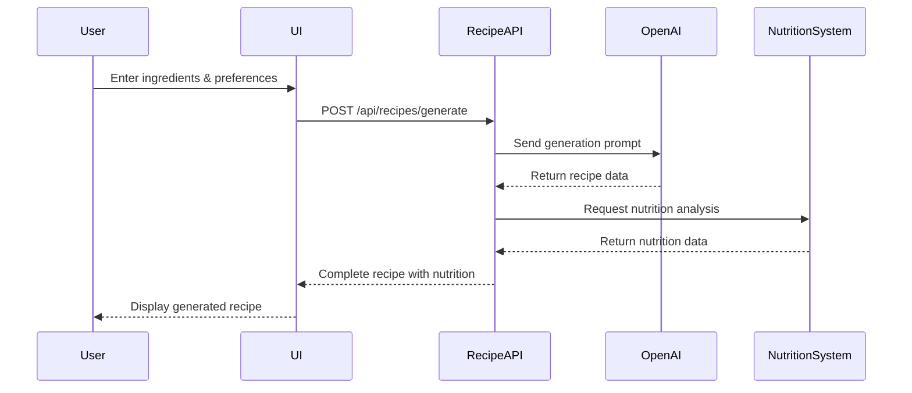
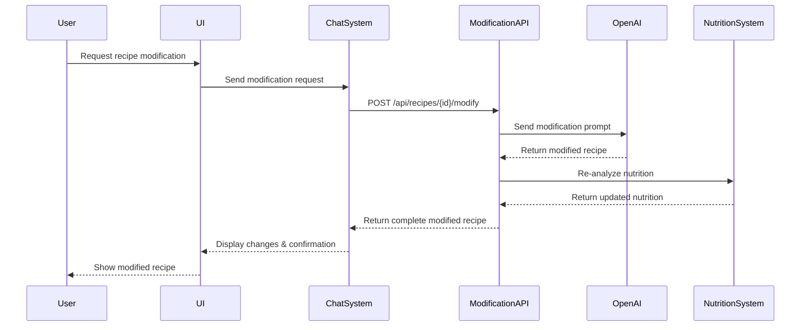
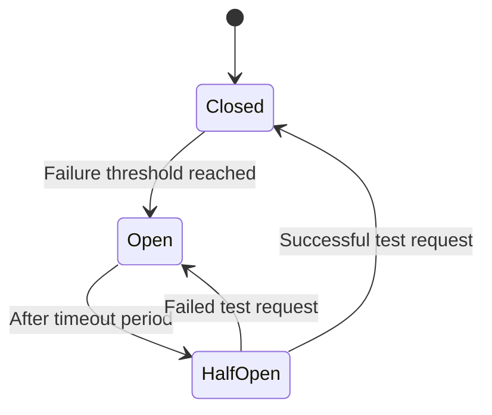

# Integration Patterns

This document details the integration patterns used throughout the Recipe Alchemy platform, explaining how different systems interact and maintain consistency.

## System Interactions

Recipe Alchemy uses several integration patterns to enable communication between its subsystems:

### 1. REST API Integration

Most service-to-service communication uses REST APIs with these standardized patterns:

- **Endpoint Naming** - `/api/v1/{resource}/{id}/{action}`
- **Status Codes** - Standard HTTP status codes with consistent error responses
- **Authentication** - JWT-based authentication using Supabase Auth
- **Rate Limiting** - Graduated rate limits based on user tier
- **Versioning** - URI-based versioning (v1, v2) for backward compatibility

### 2. Event-Driven Integration

For asynchronous processes, we use an event-driven approach:

- **Supabase Realtime** - For real-time updates and collaboration
- **Database Triggers** - For cascading updates across related data
- **Webhook System** - For integration with external systems

## Sequence Diagrams

### Recipe Creation Flow

### Recipe Modification Flow

## Data Consistency

To maintain data consistency across integrated systems:

### 1. Recipe Data Consistency

When a recipe is modified:
1. A new version is created rather than updating the original
2. References to the recipe are updated to the latest version
3. Previous versions remain accessible in history
4. Nutritional data is recalculated for the new version

### 2. Nutritional Data Integrity

To ensure nutritional calculations remain accurate:
1. Ingredient quantities and units are normalized before calculation
2. Confidence scores indicate calculation reliability
3. Food database mappings are version-controlled
4. Manual overrides are recorded separately from automatic calculations

## Contract Testing

Integration points are validated through:

1. **Contract Tests** - Verify API input/output conformance
2. **Consumer-Driven Contracts** - Frontend requirements drive API specifications
3. **Schema Validation** - JSON Schema validation for all API responses
4. **Automated Integration Tests** - Regular verification of cross-system functions

## Recovery Strategies

When one subsystem fails, these recovery patterns are employed:

### 1. Circuit Breaker Pattern

- **Closed State** - Normal operation, requests pass through
- **Open State** - Failure detected, requests fail fast
- **Half-Open** - Testing if system has recovered

### 2. Retry Policies

Different integration points use appropriate retry strategies:

- **OpenAI API** - Exponential backoff with jitter
- **Database Operations** - Immediate retry with 3 attempts
- **Internal Services** - Circuit breaker with fallback

### 3. Fallback Content

When integration fails, appropriate fallbacks are used:

- **Recipe Generation** - Simplified template-based recipes
- **Nutrition Analysis** - Estimated values from similar recipes
- **Science Content** - Pre-written general explanations

## Event Flow

Major business events flow through the system as follows:

1. **Recipe Created**
   - Recipe saved to database
   - Nutrition analysis triggered
   - Science content generation triggered
   - User history updated
   
2. **Recipe Modified**
   - New version created
   - Previous version linked
   - Nutrition recalculated
   - Science content updated
   
3. **Shopping List Created**
   - Items organized by department
   - Package sizes suggested
   - Linked to source recipe

## Related Documentation

- [System Architecture](./system-architecture.md) - Overall system architecture
- [Recipe Generation Pipeline](../systems/recipe-generation-pipeline.md) - Recipe creation flow
- [Recipe Modification Pipeline](../systems/recipe-modification-pipeline.md) - Recipe modification flow
- [Recipe Chat System](../systems/recipe-chat-system.md) - Chat system architecture
