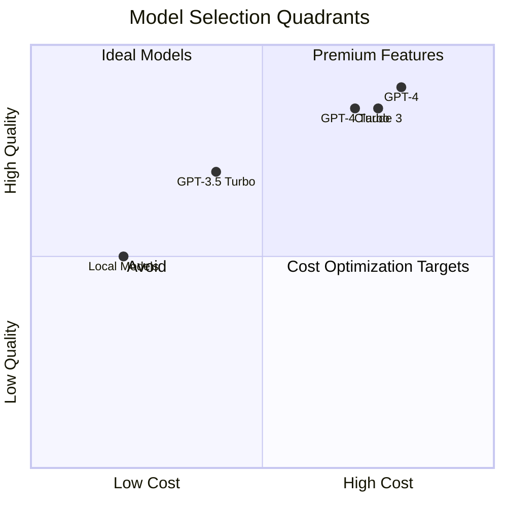
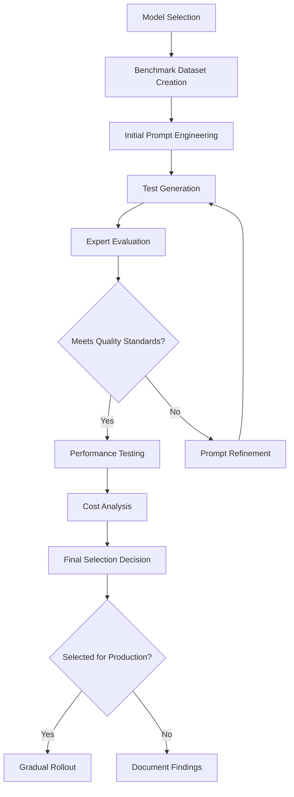

# AI Model Selection Rationale

This document outlines the strategy, criteria, and processes for selecting AI models throughout the Recipe Alchemy platform.

## Model Selection Framework

Recipe Alchemy uses a structured framework for AI model selection:

### Key Selection Criteria

| Criterion | Weight | Evaluation Method |
|-----------|--------|-------------------|
| Output Quality | 40% | Benchmark testing, expert evaluation |
| Performance (Speed) | 20% | Response time measurement |
| Cost Efficiency | 15% | Token usage analysis, cost per recipe |
| Reliability | 15% | Error rate, consistency testing |
| Capability Match | 10% | Feature support assessment |

### Quality-Cost Balance

The platform balances quality and cost through:

## Current Model Selection

Recipe Alchemy uses these models for different functions:

### Recipe Generation Pipeline

- **Primary Model**: GPT-4 Turbo
- **Rationale**: Superior culinary knowledge, structure adherence, scientific accuracy
- **Cost Mitigation**: Optimized prompting, response caching
- **Fallback Model**: GPT-3.5 Turbo for high-traffic periods

### Recipe Modification System

- **Primary Model**: GPT-4
- **Rationale**: Complex reasoning needed for maintaining recipe integrity
- **Cost Mitigation**: Limited to paid tiers, request batching
- **Fallback Model**: Simplified modifications via GPT-3.5 Turbo

### Recipe Chat System

- **Primary Model**: GPT-3.5 Turbo
- **Rationale**: Good performance for conversational assistance at lower cost
- **Uses**: General questions, simple modifications
- **Escalation Path**: Complex queries elevated to GPT-4

### Nutrition Analysis System

- **Primary Model**: Custom fine-tuned model
- **Rationale**: Specialized for ingredient mapping and nutrition calculation
- **Supplemented By**: Rule-based systems, database lookups
- **Performance**: Higher accuracy than general models for nutrition

## Model Performance Benchmarks

### Recipe Generation Quality

Comparative benchmarks across models:

| Quality Dimension | GPT-4 | GPT-4 Turbo | GPT-3.5 Turbo | Claude 3 |
|-------------------|-------|-------------|---------------|----------|
| Culinary Accuracy | 94% | 92% | 85% | 90% |
| Scientific Accuracy | 92% | 89% | 78% | 88% |
| Recipe Structure | 98% | 96% | 90% | 95% |
| Creativity | 90% | 88% | 82% | 91% |
| Overall Score | 93.5% | 91.3% | 83.8% | 91.0% |

### Response Time Comparison

```mermaid
gantt
    title Model Response Times
    dateFormat X
    axisFormat %s
    
    section GPT-4
    Recipe Generation: 0, 22
    Modification: 0, 14
    Chat Response: 0, 5
    
    section GPT-4 Turbo
    Recipe Generation: 0, 18
    Modification: 0, 12
    Chat Response: 0, 4
    
    section GPT-3.5 Turbo
    Recipe Generation: 0, 15
    Modification: 0, 10
    Chat Response: 0, 3
```

## Testing Methodology

### Benchmark Testing Framework

Models are evaluated using:

1. **Reference Recipe Set**
   - 200 professionally created recipes as ground truth
   - Spans multiple cuisines, dietary styles
   - Range of complexity levels
   - Includes edge cases and challenging scenarios

2. **A/B Quality Comparison**
   - Blind expert evaluation
   - Side-by-side comparison of outputs
   - Structured scoring across dimensions
   - Statistical significance testing

3. **Performance Metrics**
   - Response time under varied loads
   - Token efficiency measurement
   - Consistency across repeated prompts
   - Error rate tracking

### Quality Evaluation Process

Each model undergoes this evaluation process:

## Model Drift Monitoring

### Performance Tracking

Continuous monitoring for model drift:

1. **Quality Metrics**
   - Daily benchmark testing on reference recipes
   - Quality score trend analysis
   - Anomaly detection in output patterns
   - User satisfaction correlation

2. **Statistical Monitoring**
   - Control charts for key metrics
   - Drift detection algorithms
   - A/B comparisons over time
   - Version-to-version quality comparison

### Retraining Strategy

For custom fine-tuned models:

1. **Training Data Collection**
   - User feedback incorporation
   - Error correction examples
   - New recipe styles and trends
   - Continuous benchmark collection

2. **Update Triggers**
   - Quality decline beyond threshold
   - Error pattern emergence
   - New capabilities needed
   - Underlying model updates

## Fallback Strategies

### Model Unavailability

If a primary model becomes unavailable:

1. **Graceful Degradation**
   - Automatic fallback to alternative models
   - Feature limitation where necessary
   - User notification of limited functionality
   - Quality expectation management

2. **Load Balancing**
   - Traffic distribution across multiple providers
   - Priority queueing for critical operations
   - Batch processing for non-time-sensitive tasks
   - Caching of common requests

### Recovery Process

When primary models return to availability:

1. **Gradual Transition**
   - A/B testing to confirm quality
   - Progressive traffic increase
   - Performance monitoring
   - Service restoration notification

## Cost Optimization Strategies

### Prompt Engineering for Efficiency

Techniques to reduce token usage:

1. **Context Compression**
   - Information prioritization
   - Concise instruction design
   - Example efficiency optimization
   - Response structure guidance

2. **Caching Strategy**
   - Common request identification
   - Intelligent cache invalidation
   - Response template utilization
   - Partial response caching

### Tiered Model Selection

Users receive different models based on:

1. **User Tier Mapping**
   - Free users: GPT-3.5 Turbo
   - Premium users: GPT-4 Turbo
   - Enterprise: Custom fine-tuned models

2. **Operation Complexity**
   - Simple queries: Lightweight models
   - Complex recipe creation: Advanced models
   - Critical modifications: Highest quality models

## Related Documentation

- [Recipe Generation Pipeline](../systems/recipe-generation-pipeline.md) - How models are used
- [Performance and Scaling](./performance-and-scaling.md) - Model impact on performance
- [Validation and Quality](./validation-and-quality.md) - Quality measurement
- [Integration Patterns](../architecture/integration-patterns.md) - How models are integrated
