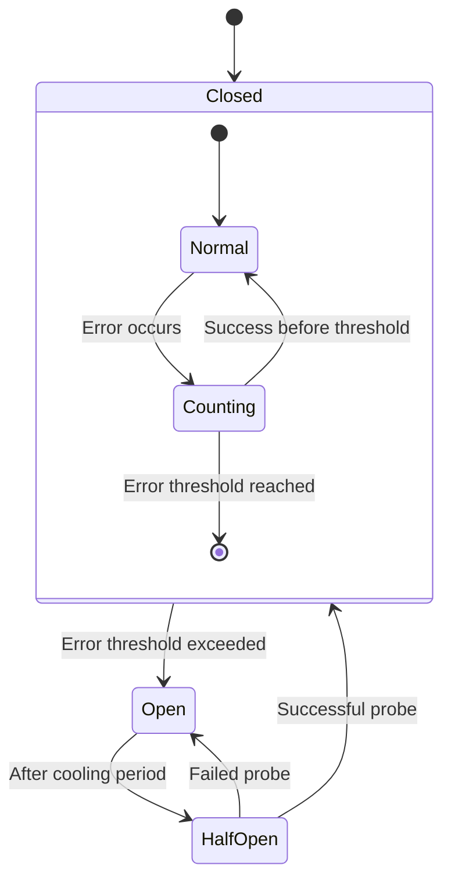
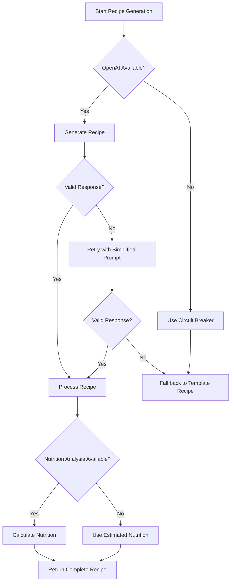
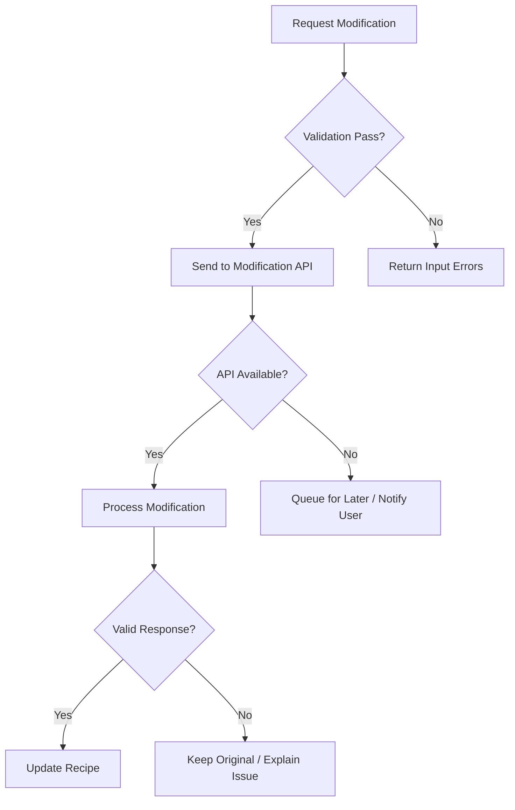

# Error Management Strategy

This document outlines the comprehensive error management approach used throughout the Recipe Alchemy platform to ensure resilience and graceful degradation when problems occur.

## Error Categorization

Recipe Alchemy categorizes errors to apply appropriate recovery strategies:

### 1. External Dependency Failures

- **OpenAI API Issues**
  - Rate limiting errors
  - Timeout errors
  - Malformed responses
  - Service unavailability

- **Database Connection Issues**
  - Connection timeouts
  - Deadlocks
  - Query timeouts
  - Capacity limits

### 2. Application Errors

- **Input Validation Errors**
  - Invalid user input
  - Malformed requests
  - Parameter validation failures

- **Processing Errors**
  - Recipe generation failures
  - Nutrition calculation errors
  - Scientific content generation failures
  - Shopping list conversion errors

### 3. User Experience Errors

- **Presentation Errors**
  - Rendering failures
  - Missing content
  - Layout issues

- **Performance Errors**
  - Slow response times
  - Client-side timeouts
  - Browser compatibility issues

## Recovery Strategies

### 1. Circuit Breaker Implementation

The platform uses circuit breakers for critical dependencies:



Implementation details:
- Error threshold: 5 errors in 60-second window
- Cooling period: Adaptive based on error type (30s to 5min)
- Half-open state: Limited probe traffic (10%)

Systems with circuit breakers:
- OpenAI API calls
- USDA database queries
- Image generation services
- External data sources

### 2. Retry Policies

Different components use appropriate retry strategies:

| System Component | Retry Strategy | Max Attempts | Backoff | Jitter |
|------------------|----------------|--------------|---------|--------|
| OpenAI API       | Exponential    | 3            | 2-8s    | Yes    |
| Database Writes  | Immediate      | 2            | None    | No     |
| Database Reads   | Linear         | 3            | 1s      | Yes    |
| Image Generation | Exponential    | 2            | 1-4s    | Yes    |

Implementation example:
```typescript
async function retryWithBackoff(operation, maxAttempts = 3) {
  let attempt = 0;
  while (attempt < maxAttempts) {
    try {
      return await operation();
    } catch (error) {
      attempt++;
      if (attempt >= maxAttempts) throw error;
      
      // Calculate backoff with jitter
      const baseDelay = Math.pow(2, attempt) * 1000; // Exponential
      const jitter = Math.random() * 1000;
      const delay = baseDelay + jitter;
      
      await sleep(delay);
    }
  }
}
```

### 3. Graceful Degradation

When services are impaired, the system degrades gracefully:

| Service | Degradation Strategy |
|---------|----------------------|
| Recipe Generation | Fall back to template-based recipes |
| Nutrition Analysis | Show estimated ranges instead of precise values |
| Scientific Content | Display pre-written generic explanations |
| Image Generation | Use category-based stock images |
| Recipe Chat | Limit to common questions with pre-computed answers |

## Error Recovery Flows

### Recipe Generation Error Recovery



### Recipe Modification Error Flow



## User-Facing Error Messages

Error communications follow these principles:

1. **Clarity** - Clear explanation of what happened
2. **Action** - What the user can do about it
3. **Transparency** - Honest about system limitations
4. **Helpfulness** - Suggest alternatives when possible

Examples:

| Error Type | User Message |
|------------|--------------|
| Recipe Generation Timeout | "We're having trouble creating your recipe right now. This could be due to high demand. You can try again in a few minutes or try with fewer ingredients." |
| OpenAI Unavailable | "Our recipe creation service is experiencing technical difficulties. We've saved your ingredients and will notify you when service is restored." |
| Nutrition Calculation Error | "We couldn't calculate exact nutrition for some ingredients. The values shown are estimates based on similar recipes." |

## Monitoring and Alerting

Error management is supported by:

1. **Real-time Monitoring**
   - Error rate dashboards
   - Circuit breaker status visualization
   - Dependency health checks

2. **Alerting Thresholds**
   - >5% error rate triggers investigation alert
   - Circuit breaker trips generate immediate alerts
   - Pattern detection for recurring errors

3. **Error Analytics**
   - Error aggregation by type and component
   - Impact analysis (users affected)
   - Trend analysis for systemic issues

## Related Documentation

- [Monitoring and Analytics](./monitoring-and-analytics.md) - Error monitoring details
- [System Architecture](../architecture/system-architecture.md) - System resilience design
- [Validation and Quality](./validation-and-quality.md) - Error prevention strategies
