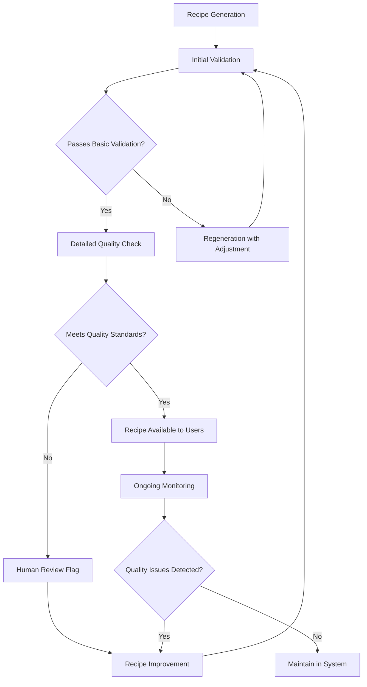

# Validation and Quality Assurance

This document outlines the strategies and processes used to ensure the accuracy, reliability, and quality of content generated by the Recipe Alchemy platform.

## Recipe Validation Framework

### Recipe Quality Metrics

Each generated recipe is evaluated against these quality criteria:

| Quality Dimension | Evaluation Method | Minimum Threshold |
|-------------------|-------------------|-------------------|
| Culinary Coherence | AI validation model | 85% coherence score |
| Step Completeness | Required step presence | All essential steps present |
| Nutrition Accuracy | Comparison to reference DB | Within 15% of reference values |
| Scientific Accuracy | Fact verification | No scientific inaccuracies |
| User Experience | User ratings and feedback | Average rating ≥ 4.0/5.0 |

### Recipe Validation Process

## Nutrition Validation

### Nutrition Calculation Accuracy

Nutrition data undergoes these validation steps:

1. **Ingredient Mapping Validation**
   - Automated mapping to USDA database
   - Confidence scoring for each mapping
   - Fallback to similar ingredients when exact match unavailable
   - Human review for low-confidence mappings

2. **Calculation Verification**
   - Cross-check against reference values
   - Statistical outlier detection
   - Unit conversion validation
   - Portion size verification

3. **Nutritional Coherence**
   - Macro ratio verification
   - Energy balance validation
   - Micronutrient plausibility checks
   - Comparison to similar recipes

### Confidence Scoring

Each nutritional calculation includes a confidence score:

| Score Range | Interpretation | Action Taken |
|-------------|----------------|--------------|
| 90-100% | High confidence | Displayed as accurate |
| 70-89% | Good confidence | Displayed with minor disclaimers |
| 50-69% | Moderate confidence | Displayed as estimates |
| <50% | Low confidence | Shown as rough approximations |

## Scientific Content Validation

### Accuracy Verification

Scientific explanations undergo these checks:

1. **Fact Checking**
   - Comparison to scientific literature
   - Verification against cooking science texts
   - Temperature and time range validation
   - Chemical process accuracy confirmation

2. **Expert Review Cycles**
   - Regular auditing by food scientists
   - Feedback incorporation into prompts
   - Sample set verification
   - Error pattern identification

3. **Ongoing Improvement**
   - Scientific content versioning
   - Accuracy trend analysis
   - Prompt refinement based on accuracy metrics
   - Knowledge base expansion

### Scientific Style Consistency

López-Alt style scientific content is validated for:
- Appropriate depth of explanation
- Accessibility to non-experts
- Practical relevance to cooking
- Consistency with established scientific consensus

## User Feedback Collection

### Feedback Mechanisms

Quality signals are collected through:

1. **Explicit Feedback**
   - Recipe ratings (1-5 stars)
   - Scientific content helpfulness ratings
   - Recipe comments and reviews
   - Report inaccuracy buttons

2. **Implicit Feedback**
   - Recipe completion tracking
   - Modification frequency
   - Save and share rates
   - Print frequency

3. **Targeted Quality Surveys**
   - Random sampling for detailed feedback
   - A/B testing of content quality
   - Comparative evaluation against human-authored content
   - Expert panel assessments

### Feedback Integration

User signals are incorporated through:

1. **Prompt Engineering Feedback Loop**
   - Identifying patterns in low-rated recipes
   - Extracting features from high-rated recipes
   - Continuous prompt refinement
   - A/B testing of prompt variations

2. **Content Improvement Pipeline**
   - Automated flagging of problematic content
   - Prioritized review queue
   - Systematic improvement of flagged content
   - Before/after quality comparisons

## Quality Monitoring Systems

### Automated Monitoring

Quality metrics are continuously tracked:

1. **Quality Dashboards**
   - Overall quality score trends
   - Quality by recipe category
   - Quality by dietary restriction
   - Scientific accuracy metrics

2. **Anomaly Detection**
   - Sudden quality score changes
   - Unusual patterns in user feedback
   - Unexpected content patterns
   - Model performance drift

### Benchmarking

Regular benchmarking against quality standards:

1. **Internal Benchmarks**
   - Reference recipe set with established quality
   - Periodic regeneration of benchmark recipes
   - Comparative analysis of quality metrics
   - Version-to-version quality comparison

2. **External Benchmarks**
   - Comparison to published recipes
   - Professional culinary standards alignment
   - Nutritional accuracy vs. professional analysis
   - Scientific accuracy vs. culinary literature

## Version Control and Review

### AI Prompt Management

Prompt quality is maintained through:

1. **Prompt Version Control**
   - Git-based version tracking
   - Changelog documentation
   - A/B testing results for each version
   - Quality impact assessment per change

2. **Review Process**
   - Multi-stage review for prompt changes
   - Quality evaluation before deployment
   - Canary testing in production
   - Automated quality regression testing

### Content Governance

Recipe content is governed by:

1. **Content Standards**
   - Written guidelines for acceptable content
   - Prohibited content definitions
   - Scientific accuracy requirements
   - Nutritional information standards

2. **Moderation System**
   - Automated content screening
   - Human review for flagged content
   - User-reported content process
   - Appeal and correction procedures

## Quality Improvement Examples

### Before/After Case Studies

| Quality Issue | Before | Improvement Action | After |
|---------------|--------|-------------------|-------|
| Incomplete steps | "Cook until done" | Step specificity enhancement | "Cook for 15-20 minutes until internal temperature reaches 165°F/74°C" |
| Vague quantities | "Add some salt" | Measurement standardization | "Add ¼ teaspoon salt, adjusting to taste" |
| Scientific inaccuracy | "Searing locks in juices" | Scientific fact correction | "Searing creates a flavorful Maillard reaction crust on the exterior" |
| Nutrition miscalculation | 450 calories (understated) | Ingredient mapping improvement | 580 calories (verified) |

## Related Documentation

- [AI Prompts Overview](../ai-prompts/overview.md) - How prompts are designed for quality
- [Nutrition Analysis System](../systems/nutrition-analysis-system.md) - Nutrition calculation methodology
- [Science Analysis System](../systems/science-analysis-system.md) - Scientific content generation
- [AI Model Selection](./ai-model-selection.md) - Model quality considerations
