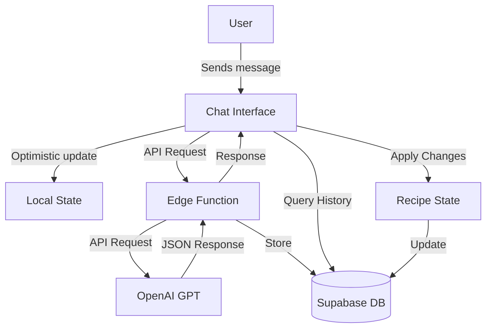

# Recipe Chat System Documentation

## Architecture Overview

The Recipe Chat system enables users to interact with an AI-powered culinary assistant that can analyze recipes, suggest improvements, and apply changes. The system integrates multiple components to create a seamless conversational experience focused on recipe enhancement.



### Core Components

1. **Frontend Components**
   - Chat interface (input, message history, response display)
   - Changes visualization and application UI
   - Optimistic updates for real-time feedback

2. **Backend Services**
   - Supabase Edge Function for AI communication
   - Database storage for chat history
   - Recipe update validation and processing

3. **AI Integration**
   - OpenAI GPT model with specialized culinary prompts
   - Structured output processing
   - Change recommendation generation

## User Interface Components

### Chat Layout Components

The chat interface is composed of several specialized components:

- `RecipeChat.tsx`: Main container component
- `ChatHistory.tsx`: Message history display
- `ChatMessage.tsx`: Individual message rendering
- `ChatResponse.tsx`: AI response display with formatting
- `RecipeChatInput.tsx`: User input component with file/URL upload
- `EmptyChatState.tsx`: Initial empty state guidance
- `ChatProcessingIndicator.tsx`: Loading states

### Key UI Features

1. **Real-time Message Processing**
   - Optimistic updates show pending messages immediately
   - Processing indicators with retry capability
   - Smooth scrolling to new messages

2. **Response Visualization**
   - Rich text formatting with ingredient highlighting
   - Code block and scientific notation support
   - Changes summary with visual differentiation

3. **Action Components**
   - Apply changes buttons with confirmation
   - Follow-up question suggestions
   - Retry mechanisms for failed operations
   - File and URL input options

## Data Flow

### Message Submission Process

1. **User Input Capture**
   ```typescript
   const handleSubmit = () => {
     if (message.trim()) {
       sendMessage();
       setTimeout(scrollToBottom, 50);
     }
   };
   ```

2. **Optimistic Update Creation**
   ```typescript
   const addOptimisticMessage = useCallback((message: OptimisticMessage) => {
     const timestamp = Date.now();
     const optimisticId = `optimistic-${timestamp}-${Math.random().toString(36).substr(2, 5)}`;
     
     const messageMeta = {
       optimistic_id: message.id || optimisticId,
       processing_stage: 'pending',
       timestamp: timestamp
     };
     
     const enhancedMessage = {
       ...message,
       id: message.id || optimisticId,
       meta: messageMeta,
       pending: true
     };
     
     setOptimisticMessages(prev => [...prev, enhancedMessage]);
     return optimisticId;
   }, []);
   ```

3. **Backend Request Processing**
   ```typescript
   const makeRequest = async (retryCount = 0) => {
     try {
       const timeout = 60000 + (retryCount * 15000); // 60s, 75s, 90s, 105s
       
       const response = await Promise.race([
         supabase.functions.invoke('recipe-chat', {
           body: { recipe, userMessage: message, sourceType, sourceUrl, sourceImage }
         }),
         new Promise((_, reject) => 
           setTimeout(() => reject(new Error("Request timed out")), timeout)
         )
       ]);
       
       if (response.error) throw response.error;
       return response;
     } catch (error) {
       // Retry logic for retriable errors
       if (retryCount < 3 && isRetriableError(error)) {
         return makeRequest(retryCount + 1);
       }
       throw error;
     }
   };
   ```

4. **Database Storage**
   ```typescript
   const { data, error } = await supabase
     .from('recipe_chats')
     .insert({
       recipe_id: recipe.id,
       user_message: message,
       ai_response: aiResponse,
       changes_suggested: response.data.changes || null,
       source_type: sourceType || 'manual',
       source_url: sourceUrl,
       source_image: sourceImage,
       meta: meta
     })
     .select()
     .single();
   ```

### Chat History Management

1. **Query History**
   ```typescript
   const { data: chatHistory = [], isLoading } = useQuery({
     queryKey: ['recipe-chats', recipeId],
     queryFn: async () => {
       const { data, error } = await supabase
         .from('recipe_chats')
         .select('*')
         .eq('recipe_id', recipeId)
         .is('deleted_at', null)
         .order('created_at', { ascending: true });

       if (error) throw error;
       return processMessages(data);
     }
   });
   ```

2. **Optimistic Updates Management**
   ```typescript
   const cleanupOptimisticMessages = useCallback((messages, history) => {
     const replacedOptimisticIds = new Set<string>();
     
     history.forEach(message => {
       const optimisticId = getChatMeta(message, 'optimistic_id', '');
       if (optimisticId) replacedOptimisticIds.add(optimisticId);
     });
     
     return messages.filter(message => {
       const messageId = getChatMeta(message, 'optimistic_id', '') || message.id;
       return !messageId || !replacedOptimisticIds.has(messageId);
     });
   }, []);
   ```

3. **Message Reconciliation**
   ```typescript
   const combinedMessages = useMemo(() => {
     const optimisticIds = new Set(
       optimisticMessages.map(msg => getMessageTrackingId(msg)).filter(Boolean)
     );
     
     const filteredChatHistory = chatHistory.filter(msg => {
       const trackingId = getMessageTrackingId(msg);
       return !trackingId || !optimisticIds.has(trackingId);
     });
     
     return [...filteredChatHistory, ...optimisticMessages];
   }, [chatHistory, optimisticMessages]);
   ```

## AI Prompting System

### López-Alt Style Culinary Science Prompting

The system uses specialized prompts inspired by J. Kenji López-Alt's scientific approach to cooking:

```javascript
const recipeAnalysisPrompt = `You are a culinary scientist and expert chef in the López-Alt tradition, analyzing recipes through the lens of food chemistry and precision cooking techniques.

Focus on:
1. COOKING CHEMISTRY:
   - Identify key chemical processes (e.g., Maillard reactions, protein denaturation, emulsification)
   - Explain temperature-dependent reactions and their impact on flavor/texture
   - Note critical control points where chemistry affects outcome
   - Consider various reactions relevant to the specific recipe context

2. TECHNIQUE OPTIMIZATION:
   - Provide appropriate temperature ranges (°F and °C) and approximate timing guidelines
   - Include multiple visual/tactile/aromatic doneness indicators when possible
   - Consider how ingredient preparation affects final results
   - Suggest equipment options and configuration alternatives
   - Balance precision with flexibility based on context

3. INGREDIENT SCIENCE:
   - Functional roles, temp-sensitive items, evidence-based substitutions
   - Recommend evidence-based technique modifications
   - Explain the chemistry behind each suggested change`;
```

### Standard Chat System Prompt

For regular recipe chat interactions:

```javascript
const chatSystemPrompt = `You are a culinary scientist specializing in food chemistry and cooking techniques. When suggesting changes to recipes:

1. Always format responses as JSON with changes
2. For cooking instructions:
   - Include specific temperatures (F° and C°)
   - Specify cooking durations
   - Add equipment setup details
   - Include doneness indicators
   - Add resting times when needed
3. Format ingredients with exact measurements and shopability:
   - US-imperial first, metric in ( )
   - Each item gets a typical US grocery package size
   - Include \`shop_size_qty\` and \`shop_size_unit\`
4. Validate all titles are descriptive and clear`;
```

### Input Construction

Each request combines multiple contextual elements:

```javascript
const prompt = `
Current recipe:
${JSON.stringify(recipe)}

User request:
${userMessage}

${sourceType === 'analysis' ? analysisInstructions : ''}

Please respond conversationally in plain text. If suggesting changes, include them in a separate JSON structure.
If relevant, provide cooking advice and tips as a culinary expert would.
Always include 2-3 follow-up questions at the end that the user might want to ask next.
`;
```

## Response Processing

### JSON Parsing and Validation

The system uses a robust validation process to ensure consistent response structures:

```javascript
function validateRecipeChanges(rawResponse) {
  try {
    const parsedResponse = JSON.parse(rawResponse);
    
    // Ensure ingredients structure is consistent
    if (parsedResponse.changes && parsedResponse.changes.ingredients) {
      if (!Array.isArray(parsedResponse.changes.ingredients.items) || 
          parsedResponse.changes.ingredients.items.length === 0) {
        parsedResponse.changes.ingredients.mode = "none";
        parsedResponse.changes.ingredients.items = [];
      }
    } else if (parsedResponse.changes) {
      parsedResponse.changes.ingredients = { mode: "none", items: [] };
    }
    
    // Standardize science_notes format
    if (parsedResponse.science_notes) {
      if (!Array.isArray(parsedResponse.science_notes)) {
        parsedResponse.science_notes = [];
      } else {
        parsedResponse.science_notes = parsedResponse.science_notes
          .filter(note => typeof note === 'string' && note.trim() !== '')
          .map(note => note.trim());
      }
    }
    
    return parsedResponse;
  } catch (error) {
    // Fallback for parsing errors
    return {
      textResponse: rawResponse,
      changes: { mode: "none" }
    };
  }
}
```

### Text Formatting

The system includes specialized text processing to highlight key information:

```typescript
const { displayText, showWarning, changesPreview, isMethodology } = useResponseFormatter({ 
  response, 
  changesSuggested 
});

// Text highlighting process
function highlightIngredients(text, changesSuggested) {
  if (!changesSuggested?.ingredients?.items?.length) return text;
  
  let result = text;
  changesSuggested.ingredients.items.forEach(ingredient => {
    const regex = new RegExp(`\\b${escapeRegExp(ingredient.item)}\\b`, 'gi');
    result = result.replace(regex, `<span class="highlight-ingredient">$&</span>`);
  });
  
  return result;
}
```

## Recipe Modification Engine

### Change Validation

Before applying changes, the system performs rigorous validation:

```typescript
function validateRecipeUpdate(recipe, changes) {
  if (!recipe || !recipe.id) return false;
  if (!changes) return false;
  
  // Validate title changes
  if (changes.title && typeof changes.title !== 'string') return false;
  
  // Validate ingredient changes
  if (changes.ingredients) {
    const { mode, items } = changes.ingredients;
    if (!['add', 'replace', 'none'].includes(mode)) return false;
    if (mode !== 'none' && (!Array.isArray(items) || items.length === 0)) return false;
  }
  
  // Validate instruction changes
  if (changes.instructions && !Array.isArray(changes.instructions)) return false;
  
  // All validations passed
  return true;
}
```

### Update Application

The update process creates a copy of the recipe with changes applied:

```typescript
function processRecipeUpdates(recipe, chatMessage) {
  // Start with a complete copy of the original recipe
  const updatedRecipe = {
    ...recipe,
    updated_at: new Date().toISOString()
  };

  // Apply title changes
  if (chatMessage.changes_suggested?.title) {
    updatedRecipe.title = chatMessage.changes_suggested.title;
  }

  // Apply nutrition changes
  if (chatMessage.changes_suggested?.nutrition) {
    updatedRecipe.nutrition = chatMessage.changes_suggested.nutrition;
  }

  // Apply science notes
  if (chatMessage.changes_suggested?.science_notes?.length > 0) {
    updatedRecipe.science_notes = chatMessage.changes_suggested.science_notes;
  }

  // Apply instruction changes
  if (chatMessage.changes_suggested?.instructions?.length > 0) {
    updatedRecipe.instructions = chatMessage.changes_suggested.instructions.map(
      instruction => typeof instruction === 'string' ? instruction : instruction.action
    );
  }

  // Apply ingredient changes
  if (chatMessage.changes_suggested?.ingredients) {
    const { mode, items } = chatMessage.changes_suggested.ingredients;
    
    switch (mode) {
      case 'replace':
        updatedRecipe.ingredients = items;
        break;
      case 'add':
        updatedRecipe.ingredients = [...recipe.ingredients, ...items];
        break;
      // 'none' - no changes
    }
  }

  return updatedRecipe;
}
```

## Error Handling & Recovery

### Circuit Breaker Pattern

The system implements a circuit breaker to prevent cascading failures:

```javascript
class CircuitBreaker {
  private failures = 0;
  private lastFailureTime: number | null = null;
  private isOpen = false;

  constructor(
    private maxFailures = 5,
    private resetTimeout = 30000 // 30 seconds
  ) {}

  async execute(fn) {
    if (this.isOpen) {
      if (Date.now() - (this.lastFailureTime || 0) > this.resetTimeout) {
        this.reset();
      } else {
        throw new Error("Circuit is open, request rejected");
      }
    }

    try {
      const result = await fn();
      this.onSuccess();
      return result;
    } catch (error) {
      this.onFailure();
      throw error;
    }
  }

  private onSuccess() {
    this.failures = 0;
  }

  private onFailure() {
    this.failures++;
    this.lastFailureTime = Date.now();
    
    if (this.failures >= this.maxFailures) {
      this.isOpen = true;
    }
  }

  private reset() {
    this.failures = 0;
    this.isOpen = false;
    this.lastFailureTime = null;
  }
}
```

### Retry Mechanisms

The system uses progressive retry with exponential backoff:

```typescript
// Implement enhanced request timeout handling with retry logic
const makeRequest = async (retryCount = 0) => {
  try {
    // Set progressively longer timeouts for retries
    const timeout = 60000 + (retryCount * 15000); // 60s, 75s, 90s, 105s
    
    const response = await Promise.race([
      supabase.functions.invoke('recipe-chat', {
        body: { 
          recipe, 
          userMessage: message,
          sourceType,
          sourceUrl,
          sourceImage,
          messageId,
          retryAttempt: retryCount
        }
      }),
      new Promise((_, reject) => 
        setTimeout(() => reject(new Error("Request timed out")), timeout)
      )
    ]);
    
    if (response.error) throw response.error;
    return response;
  } catch (error) {
    // Implement retry for certain errors with exponential backoff
    const isRetriableError = 
      error.message?.includes("timeout") || 
      error.message?.includes("network") || 
      error.status === 503 || 
      error.status === 504;
      
    if (retryCount < 3 && isRetriableError) {
      console.log(`Retrying request (attempt ${retryCount + 1})...`);
      await new Promise(resolve => 
        setTimeout(resolve, 1000 * Math.pow(2, retryCount))
      );
      return makeRequest(retryCount + 1);
    }
    throw error;
  }
};
```

## Technical Schema Reference

### ChatMessage Structure

```typescript
interface ChatMessage {
  id?: string;
  user_message: string;
  ai_response?: string;
  recipe_id?: string;
  created_at?: string;
  changes_suggested?: ChangesResponse;
  applied?: boolean;
  follow_up_questions?: string[];
  meta?: ChatMeta;
}

// Enhanced ChatMeta type for better type safety
interface ChatMeta {
  optimistic_id?: string;
  tracking_id?: string;
  processing_stage?: 'pending' | 'completed' | 'failed';
  source_info?: {
    type?: 'manual' | 'image' | 'url' | 'analysis';
    url?: string;
    imageId?: string;
  };
  [key: string]: any; // Allow for other meta properties
}

interface OptimisticMessage extends ChatMessage {
  pending?: boolean;
  id?: string;
  error?: string | null;
  timestamp?: number;
}
```

### ChangesResponse Format

```typescript
interface ChangesResponse {
  title?: string;
  ingredients?: {
    mode: 'add' | 'replace' | 'none';
    items: Ingredient[];
  };
  instructions?: string[] | Array<{
    stepNumber?: number;
    action: string;
    explanation?: string;
    whyItWorks?: string;
    troubleshooting?: string;
    indicator?: string;
  }>;
  nutrition?: Nutrition;
  equipmentNeeded?: string[];
  science_notes?: string[];
  health_insights?: string[];
}

interface Ingredient {
  qty: number;
  unit: string;
  item: string;
  notes?: string;
  shop_size_qty?: number;
  shop_size_unit?: string;
}

interface Nutrition {
  calories?: number;
  protein_g?: number;
  carbs_g?: number;
  fat_g?: number;
  fiber_g?: number;
  sugar_g?: number;
  sodium_mg?: number;
}
```

### Database Schema

Recipe chats are stored in the `recipe_chats` table:

```sql
TABLE: recipe_chats
COLUMNS:
- source_image | text | Nullable: Yes | Default: None
- applied | boolean | Nullable: Yes | Default: false
- created_at | timestamp with time zone | Nullable: No | Default: now()
- ai_response | text | Nullable: No | Default: None
- user_message | text | Nullable: No | Default: None
- changes_suggested | jsonb | Nullable: Yes | Default: None
- meta | jsonb | Nullable: Yes | Default: None
- source_type | text | Nullable: Yes | Default: None
- source_url | text | Nullable: Yes | Default: None
- deleted_at | timestamp with time zone | Nullable: Yes | Default: None
- id | uuid | Nullable: No | Default: gen_random_uuid()
- recipe_id | uuid | Nullable: No | Default: None
```

## Conclusion

The Recipe Chat system integrates advanced AI capabilities with a user-friendly interface to provide recipe analysis, recommendations, and modifications. Its architecture balances frontend responsiveness with backend processing power, while specialized culinary prompting ensures high-quality, scientifically-grounded responses. The system's robust error handling, validation mechanisms, and structured data processing create a reliable and engaging user experience for recipe enhancement.
