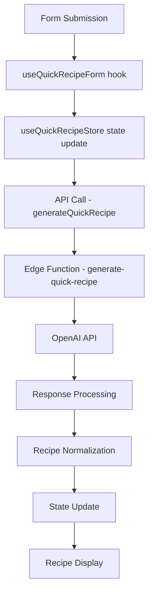

# Recipe Generation Pipeline Documentation

## Overview

This document provides a comprehensive guide to the Recipe Alchemy application's recipe generation pipeline - from user input to displaying the final recipe. The pipeline uses AI-powered generation via OpenAI's API, sophisticated state management, and careful error handling to create detailed, science-based recipes tailored to user preferences.

## Table of Contents

1. [Architecture Overview](#architecture-overview)
2. [User Interface Flow](#user-interface-flow)
3. [Data Processing Chain](#data-processing-chain)
4. [AI Prompting System](#ai-prompting-system)
5. [Request-Response Flow](#request-response-flow)
6. [Error Handling](#error-handling)
7. [Recipe Normalization](#recipe-normalization)
8. [State Management](#state-management)
9. [Performance Considerations](#performance-considerations)

## Architecture Overview

The recipe generation pipeline consists of:

1. **Frontend Components**:
   - Form components for user input 
   - Loading state components
   - Recipe display components

2. **State Management**:
   - Zustand store for recipe state management
   - React Query for data fetching and caching

3. **API Layer**:
   - Supabase Edge Functions for secure API calls
   - API utilities for handling requests and errors

4. **AI Integration**:
   - OpenAI API integration for recipe generation
   - Prompt engineering system
   - Response processing

```
User Input → Form Processing → Edge Function → OpenAI → Response Processing → Recipe Display
```

## User Interface Flow

### 1. Initial Form Input

The entry point is the `QuickRecipeFormContainer` component, which contains:

- `QuickRecipeGenerator` - The main form component
- Form elements like `IngredientInput`, `CuisineSelector`, etc.

Users provide:
- Main ingredient(s)
- Cuisine preference
- Dietary preferences
- Servings

### 2. Loading Experience

After form submission:

1. User is redirected to a loading page (`/loading`)
2. The loading page shows progress with `LoadingTransition` component
3. The loading state is updated from the API response progress

### 3. Recipe Display

Once the recipe is generated:

1. User is redirected to recipe preview (`/recipe-preview`)
2. The recipe is displayed using `RecipePreviewPage`
3. Users can then interact with the recipe (save, modify, etc.)

## Data Processing Chain



### Key Components in the Chain:

1. **Form Processing**:
   - `useQuickRecipeForm.ts` - Handles form submission and validation
   - `QuickRecipeFormContainer.tsx` - Container component for the form

2. **API Layer**:
   - `generate-quick-recipe.ts` - API function for recipe generation
   - `api-utils.ts` - Utilities for API calls

3. **Edge Function**:
   - `index.ts` - Entry point for the edge function
   - `request-handler.ts` - Processes API requests
   - `prompt-builder.ts` - Builds the AI prompt
   - `openai-client.ts` - Makes requests to OpenAI

4. **Response Processing**:
   - `recipe-normalization.ts` - Normalizes recipe data
   - `error-utils.ts` - Handles errors

## AI Prompting System

The AI prompt system is structured in `prompt-builder.ts` to generate high-quality recipes. The prompt includes:

### Prompt Structure

```typescript
// Structure overview
export function buildOpenAIPrompt(params: {
  safeCuisine: string, 
  safeMain: string, 
  safeDiet: string, 
  safeServings: number,
  safeTags: string,
  maxCalories?: number,
  uniqueId: string
}): string {
  // Build prompts with specific sections
}
```

### Main Sections of the Prompt:

1. **Basic Recipe Requirements**
   - Cuisine, dietary preferences, main ingredients, servings

2. **Cuisine Classification**
   - Ensures recipes align with the application's taxonomy

3. **Instruction Details**
   - Requirements for López-Alt scientific style
   - Temperature precision requirements
   - Step structure requirements

4. **Data Pipeline Requirements**
   - Nutrition calculation guidelines
   - Ingredient conversion specifications

5. **Response Format Specifications**
   - JSON structure requirements
   - Measurement standardization requirements

## Request-Response Flow

### 1. Form Submission

```typescript
// useQuickRecipeForm.ts (simplified)
const handleSubmit = useCallback(async (formData: QuickRecipeFormData) => {
  try {
    // Set loading state
    setLoading(true);
    setFormData(processedFormData);
    
    // Navigate to loading page
    navigate('/loading', { state: {...} });
    
    return processedFormData;
  } catch (error) {
    // Error handling
  }
}, []);
```

### 2. API Call

```typescript
// generate-quick-recipe.ts (simplified)
export const generateQuickRecipe = async (formData: QuickRecipeFormData): Promise<QuickRecipe> => {
  // Format the request body
  const requestBody = formatRequestBody(formData);
  
  // Make the API call
  const data = await Promise.race([
    callWithSupabaseFunctionClient(),
    timeoutPromise
  ]);
  
  // Normalize response
  return normalizeRecipeResponse(data);
};
```

### 3. Edge Function Processing

```typescript
// request-handler.ts (simplified)
export async function handleRequest(
  req: Request, 
  requestBody: any, 
  debugInfo: string
): Promise<Response> {
  // Process request parameters
  const { processedParams } = processRequestParams(requestBody);
  
  // Build the OpenAI prompt
  const prompt = buildOpenAIPrompt(processedParams);
  
  // Generate recipe with OpenAI
  return await generateRecipeWithOpenAI(apiKey, prompt, processedParams);
}
```

### 4. OpenAI Integration

```typescript
// openai-client.ts (simplified)
export async function generateRecipeWithOpenAI(
  apiKey: string,
  prompt: string,
  params: any,
  corsHeaders: HeadersInit,
  debugInfo: string
): Promise<Response> {
  // Make the request to OpenAI
  const response = await fetch("https://api.openai.com/v1/chat/completions", {
    method: "POST",
    headers: {
      "Authorization": `Bearer ${apiKey}`,
      "Content-Type": "application/json"
    },
    body: JSON.stringify({
      model: "gpt-4o-mini",
      messages: [
        { role: "system", content: "..." },
        { role: "user", content: prompt }
      ],
      temperature: 0.7,
      max_tokens: 2000,
      response_format: { type: "json_object" }
    })
  });
  
  // Process and return the recipe
  return new Response(JSON.stringify(recipe), { status: 200, headers: corsHeaders });
}
```

### 5. Response Processing

```typescript
// recipe-normalization.ts (simplified)
export const normalizeRecipeResponse = (data: any): QuickRecipe => {
  // Handle error states
  const hasError = data.isError === true || data.error || data.error_message;
  
  // Normalize the recipe structure
  return {
    title: data.title || "Unnamed Recipe",
    ingredients: normalizedIngredients,
    instructions: instructions,
    steps: steps,
    servings: data.servings || 4,
    // Other properties...
  };
};
```

## Error Handling

The pipeline implements multiple layers of error handling:

### 1. Frontend Error Handling

- **Form Validation**:
  - Validates required fields before submission
  - Prevents submission of invalid data

- **Network Error Detection**:
  ```typescript
  if (!navigator.onLine) {
    return {
      title: "Network Error",
      description: "You appear to be offline...",
      isError: true
    };
  }
  ```

- **Timeout Handling**:
  ```typescript
  // Set a timeout for the request (120 seconds)
  const timeoutPromise = createTimeoutPromise(120000);
  
  // Race both approaches against the timeout
  const data = await Promise.race([
    callWithSupabaseFunctionClient(),
    timeoutPromise
  ]);
  ```

### 2. Edge Function Error Handling

- **Request Validation**:
  - Validates content type, request body, etc.
  - Returns appropriate error responses

- **OpenAI Error Handling**:
  - Handles non-successful responses
  - Provides detailed error messages
  - Implements timeout for OpenAI requests

### 3. Recipe Normalization Error Handling

- **Data Validation**:
  - Detects missing required fields
  - Provides reasonable default values
  - Ensures consistent data structure

- **Graceful Degradation**:
  - Constructs valid recipes even with partial data
  - Includes error messages in the recipe for display

### 4. User Experience During Errors

- **Error Display Components**:
  - `QuickRecipeError` component shows friendly error messages
  - Provides retry and cancel options

- **Loading State Management**:
  - Updates loading state during request failures
  - Shows appropriate error messages

## Recipe Normalization

The `normalizeRecipeResponse` function ensures that recipe data is consistent regardless of the AI response format. Key normalization steps:

### 1. Error Detection

```typescript
// Check for error flags in the original data and preserve them
const hasError = data.isError === true || data.error || data.error_message;
```

### 2. Ingredient Normalization

```typescript
// Normalize ingredients to include both metric and imperial units
const ingredients = data.ingredients?.map((ingredient: any) => {
  // If already in the correct format with metric/imperial units
  if (ingredient.qty_metric !== undefined || ingredient.qty_imperial !== undefined) {
    return ingredient;
  }
  
  // Otherwise normalize to our expected format
  return {
    qty: ingredient.qty,
    unit: ingredient.unit,
    // Add metric and imperial units
    qty_metric: ingredient.qty,
    unit_metric: ingredient.unit,
    qty_imperial: ingredient.qty,
    unit_imperial: ingredient.unit,
    item: ingredient.item,
    notes: ingredient.notes,
    // Other properties...
  };
}) || [];
```

### 3. Instructions/Steps Normalization

```typescript
// Always ensure steps and instructions exist
const steps = data.steps || data.instructions || ["Recipe steps could not be generated"];
const instructions = data.instructions || data.steps || ["Recipe instructions could not be generated"];
```

### 4. Fallback Values

```typescript
// Normalize the recipe structure with fallbacks
return {
  title: data.title || "Unnamed Recipe",
  tagline: data.tagline || data.description || "",
  description: data.description || "",
  ingredients: ingredients,
  instructions: instructions,
  steps: steps,
  servings: data.servings || 4,
  // Other properties with fallbacks...
};
```

## State Management

The pipeline uses Zustand for state management with the `useQuickRecipeStore` custom store:

### 1. Store Structure

```typescript
// Key state elements
interface QuickRecipeState {
  recipe: QuickRecipe | null;
  isLoading: boolean;
  formData: QuickRecipeFormData | null;
  error: string | null;
  hasTimeoutError: boolean;
  loadingState: LoadingState;
  // Other state properties...
}
```

### 2. State Updates

```typescript
// Key state updates
interface QuickRecipeActions {
  setRecipe: (recipe: QuickRecipe) => void;
  setLoading: (isLoading: boolean) => void;
  setError: (error: string | null) => void;
  setFormData: (formData: QuickRecipeFormData) => void;
  setHasTimeoutError: (hasTimeout: boolean) => void;
  reset: () => void;
  updateLoadingState: (state: Partial<LoadingState>) => void;
  // Other actions...
}
```

### 3. Loading State Management

```typescript
// Loading state updates
const updateLoadingState = useCallback((state: Partial<LoadingState>) => {
  set(prevState => ({
    loadingState: {
      ...prevState.loadingState,
      ...state
    }
  }));
}, []);
```

### 4. React Query Integration

The pipeline uses React Query for data fetching alongside Zustand:

```typescript
// useQuickRecipe hook
export const useQuickRecipe = (id?: string) => {
  return {
    useQuery: useQuery({
      queryKey: ['quick-recipe', id],
      queryFn: () => fetchRecipe(id as string),
      enabled: !!id,
      // Other query config...
    }),
    generateQuickRecipe
  };
};
```

## Performance Considerations

### 1. Request Optimization

- **Timeout Management**:
  - Sets appropriate timeouts for OpenAI requests
  - Implements race conditions to handle slow responses

- **Error Recovery**:
  - Implements retry logic for failed requests
  - Falls back to alternative approaches when needed

### 2. State Performance

- **Selective Re-renders**:
  - Uses Zustand selectors to minimize re-renders
  - Optimizes component updates during loading states

- **Caching**:
  - Uses React Query caching for recipe data
  - Implements stale-while-revalidate pattern

### 3. Loading Experience

- **Progressive Loading States**:
  - Shows step-by-step loading progress
  - Provides estimated time remaining
  - Updates loading state based on API progress

## JSON Recipe Structure

The final recipe structure follows this JSON format:

```json
{
  "title": "Recipe Title",
  "description": "One sentence of the key science insight",
  "ingredients": [
    {
      "qty_imperial": 2,
      "unit_imperial": "cups",
      "qty_metric": 473,
      "unit_metric": "ml",
      "shop_size_qty": 16,
      "shop_size_unit": "oz",
      "item": "ingredient name",
      "notes": "additional notes"
    }
  ],
  "steps": [
    "Detailed instruction string with scientific explanation"
  ],
  "prepTime": 15,
  "cookTime": 30,
  "prep_time_min": 15,
  "cook_time_min": 30,
  "servings": 4,
  "cuisine": "cuisine-value",
  "cuisine_category": "Global/Regional American/European/etc.",
  "nutritionHighlight": "One evidence-based benefit",
  "cookingTip": "One science-backed technique note",
  "nutrition": {
    "kcal": 350,
    "protein_g": 25,
    "carbs_g": 30,
    "fat_g": 15,
    "fiber_g": 5,
    "sugar_g": 10,
    "sodium_mg": 800,
    "data_quality": "complete",
    "calorie_check_pass": true
  }
}
```

## Conclusion

The Recipe Generation Pipeline represents a sophisticated system that combines user input, AI generation, and careful data processing to create scientifically-informed recipes. The pipeline prioritizes error handling, performance, and user experience to ensure reliable recipe generation even in challenging network conditions or API limitations.
