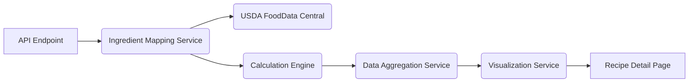

# Nutrition Analysis System

This document outlines the architecture, implementation, and data flow of the Nutrition Analysis System within the Recipe Alchemy platform.

## Overview

The Nutrition Analysis System is responsible for calculating detailed nutritional information for recipes. It maps ingredients to a standardized nutrition database, performs calculations, and generates visual representations of nutritional data.

## System Architecture

The Nutrition Analysis System consists of these components:

1. **API Endpoint**: Receives recipe data and triggers analysis
2. **Ingredient Mapping Service**: Maps ingredients to USDA FoodData Central database
3. **Calculation Engine**: Performs nutritional calculations based on ingredient quantities
4. **Data Aggregation Service**: Aggregates and formats nutritional data
5. **Visualization Service**: Generates visual representations of nutritional information



## Data Flow

1. The Recipe Detail System sends recipe data to the Nutrition Analysis System via the API endpoint.
2. The Ingredient Mapping Service maps each ingredient to a corresponding entry in the USDA FoodData Central database.
3. The Calculation Engine calculates nutritional values based on ingredient quantities and USDA data.
4. The Data Aggregation Service aggregates the calculated values and formats them into a structured response.
5. The Visualization Service generates visual representations of the nutritional information, such as charts and graphs.
6. The Recipe Detail System displays the nutritional information to the user.

## API Endpoint

The API endpoint for the Nutrition Analysis System is `/api/v1/nutrition/analyze`.

### Request

```json
{
  "recipe": {
    "ingredients": [
      {
        "name": "Chicken Breast",
        "quantity": 1,
        "unit": "lb"
      },
      {
        "name": "Broccoli",
        "quantity": 1,
        "unit": "cup"
      }
    ]
  }
}
```

### Response

```json
{
  "calories": 500,
  "protein": 50,
  "fat": 20,
  "carbohydrates": 30,
  "micronutrients": {
    "vitaminA": "10%",
    "vitaminC": "20%"
  },
  "nutriScore": "B"
}
```

## Ingredient Mapping Service

The Ingredient Mapping Service maps ingredients to the USDA FoodData Central database.

### Mapping Process

1. **Text Normalization**: Normalizes ingredient names to remove variations.
2. **Database Lookup**: Searches the USDA database for matching ingredients.
3. **Confidence Scoring**: Assigns a confidence score to each mapping based on the accuracy of the match.
4. **Fallback Mapping**: If no exact match is found, uses a fallback mapping based on similar ingredients.

### USDA FoodData Central

The USDA FoodData Central database provides detailed nutritional information for a wide range of foods.

- **Data Source**: [https://fdc.nal.usda.gov/](https://fdc.nal.usda.gov/)
- **Data Format**: JSON
- **Update Frequency**: Annually

## Calculation Engine

The Calculation Engine performs nutritional calculations based on ingredient quantities and USDA data.

### Calculation Process

1. **Unit Conversion**: Converts ingredient quantities to a standard unit (e.g., grams).
2. **Nutrient Calculation**: Calculates the amount of each nutrient based on the ingredient quantity and USDA data.
3. **Data Aggregation**: Aggregates the calculated values for all ingredients in the recipe.

### Formulas

- **Calories**: `(Protein * 4) + (Fat * 9) + (Carbohydrates * 4)`
- **Macronutrient Ratios**: `Protein % = (Protein * 4) / Calories`

## Data Aggregation Service

The Data Aggregation Service aggregates the calculated values and formats them into a structured response.

### Aggregation Process

1. **Data Summarization**: Summarizes the calculated values for each nutrient.
2. **Data Formatting**: Formats the data into a structured JSON response.
3. **NutriScore Calculation**: Calculates the NutriScore based on the nutritional profile of the recipe.

### NutriScore

The NutriScore is a nutritional label that summarizes the overall nutritional quality of a food product.

- **Scoring System**: A to E (A being the healthiest)
- **Calculation**: Based on positive and negative nutritional factors

## Visualization Service

The Visualization Service generates visual representations of nutritional information, such as charts and graphs.

### Visualization Types

- **Macronutrient Distribution Chart**: A pie chart showing the distribution of macronutrients (protein, fat, carbohydrates).
- **Micronutrient Table**: A table showing the amount of each micronutrient in the recipe.
- **NutriScore Badge**: A visual representation of the NutriScore.

### Implementation

- **Library**: Recharts
- **Chart Types**: Pie Chart, Bar Chart, Table

## Error Handling

The Nutrition Analysis System handles errors gracefully by:

1. **Logging Errors**: Logging all errors to a centralized logging system.
2. **Returning Error Messages**: Returning informative error messages to the user.
3. **Using Fallback Values**: Using fallback values when nutritional data is unavailable.

## Performance Considerations

The Nutrition Analysis System is designed for performance by:

1. **Caching Data**: Caching frequently accessed data in a Redis cache.
2. **Optimizing Queries**: Optimizing database queries for speed.
3. **Using Asynchronous Processing**: Using asynchronous processing to handle long-running calculations.

## Related Documentation

- [Data Model](../architecture/data-model.md) - Database schemas and data structures
- [AI Prompts: Nutrition Analysis](../ai-prompts/nutrition-analysis.md) - Prompts related to nutrition calculations
- [System Architecture](../architecture/system-architecture.md) - Overall system architecture
