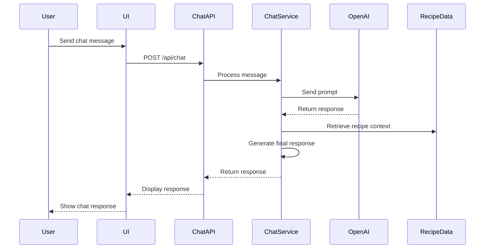

# Recipe Chat System

This document outlines the architecture, implementation, and data flow of the Recipe Chat System within the Recipe Alchemy platform.

## Overview

The Recipe Chat System provides a conversational interface for users to interact with recipes, ask questions, and request modifications. The system leverages AI to understand user queries and provide relevant responses.

## Architecture

The Recipe Chat System consists of these components:

1. **Chat Interface**: The user interface for sending and receiving messages.
2. **Chat API**: The API endpoint for processing chat requests.
3. **Chat Service**: The core logic for understanding user queries and generating responses.
4. **OpenAI Integration**: The integration with OpenAI's language models for natural language processing.
5. **Recipe Context**: The recipe data and scientific information used to answer user questions.

## System Diagram



## Data Flow

1. **User Input**: The user enters a chat message in the UI.
2. **API Request**: The UI sends a POST request to the Chat API with the user's message and the recipe ID.
3. **Message Processing**: The Chat Service receives the message and processes it.
4. **OpenAI Prompt**: The Chat Service constructs a prompt for OpenAI, including the user's message and the recipe context.
5. **OpenAI Response**: OpenAI returns a response based on the prompt.
6. **Contextualization**: The Chat Service uses the OpenAI response and the recipe context to generate a final response.
7. **API Response**: The Chat API returns the final response to the UI.
8. **User Output**: The UI displays the response to the user.

## API Endpoint

The Chat API endpoint is `/api/chat`:

- **Method**: POST
- **Request Body**:
  ```json
  {
    "recipeId": "recipe-123",
    "message": "What is the best way to sear the steak?"
  }
  ```
- **Response Body**:
  ```json
  {
    "response": "To sear the steak, use high heat (375°F/190°C) for 2-3 minutes per side. This triggers the Maillard reaction, creating a flavorful crust."
  }
  ```

## Edge Function Implementation

The `recipe-chat` Edge Function handles the core logic of the chat system:

```typescript
// supabase/functions/recipe-chat/index.ts
import { serve } from 'https://deno.land/std@0.168.0/http/server.ts';
import { corsHeaders } from '../_shared/cors.ts';
import { generateChatResponse } from './chat-service.ts';

serve(async (req) => {
  // Handle CORS preflight requests
  if (req.method === 'OPTIONS') {
    return new Response(null, { headers: corsHeaders });
  }

  try {
    const { recipeId, message } = await req.json();

    // Generate the chat response
    const response = await generateChatResponse(recipeId, message);

    // Return the response
    return new Response(
      JSON.stringify({ response }),
      { headers: { ...corsHeaders, 'Content-Type': 'application/json' }, status: 200 }
    );
  } catch (error) {
    // Handle errors
    return new Response(
      JSON.stringify({ error: error.message }),
      { headers: { ...corsHeaders, 'Content-Type': 'application/json' }, status: 500 }
    );
  }
});
```

## Chat Service

The `chat-service.ts` file contains the core logic for processing chat messages and generating responses:

```typescript
// supabase/functions/recipe-chat/chat-service.ts
import { getRecipeContext } from './recipe-context.ts';
import { generateOpenAIResponse } from './openai-integration.ts';

export async function generateChatResponse(recipeId: string, message: string): Promise<string> {
  // Get the recipe context
  const recipeContext = await getRecipeContext(recipeId);

  // Construct the prompt for OpenAI
  const prompt = `You are a helpful assistant for a recipe.
  Here is the recipe context: ${recipeContext}
  User message: ${message}
  Response:`;

  // Generate the response from OpenAI
  const openaiResponse = await generateOpenAIResponse(prompt);

  // Return the response
  return openaiResponse;
}
```

## OpenAI Integration

The `openai-integration.ts` file handles the integration with OpenAI's language models:

```typescript
// supabase/functions/recipe-chat/openai-integration.ts
import { OpenAI } from "https://deno.land/x/openai@v4.13.0/mod.ts";

const openai = new OpenAI({
  apiKey: Deno.env.get("OPENAI_API_KEY"),
});

export async function generateOpenAIResponse(prompt: string): Promise<string> {
  try {
    const completion = await openai.chat.completions.create({
      model: "gpt-3.5-turbo",
      messages: [{ role: "user", content: prompt }],
      max_tokens: 200,
    });

    return completion.choices[0].message.content;
  } catch (error) {
    console.error("OpenAI Error:", error);
    throw new Error("Failed to generate response from OpenAI");
  }
}
```

## Recipe Context

The `recipe-context.ts` file retrieves the recipe data and scientific information needed to answer user questions:

```typescript
// supabase/functions/recipe-chat/recipe-context.ts
import { supabaseFunctionClient } from '../_shared/supabaseClient.ts';

export async function getRecipeContext(recipeId: string): Promise<string> {
  try {
    const { data, error } = await supabaseFunctionClient
      .from('recipes')
      .select('title, ingredients, steps, science_notes')
      .eq('id', recipeId)
      .single();

    if (error) {
      console.error("Supabase Error:", error);
      throw new Error("Failed to retrieve recipe context");
    }

    // Format the recipe context
    const formattedContext = `
      Title: ${data.title}
      Ingredients: ${JSON.stringify(data.ingredients)}
      Steps: ${JSON.stringify(data.steps)}
      Science Notes: ${data.science_notes}
    `;

    return formattedContext;
  } catch (error) {
    console.error("Error retrieving recipe context:", error);
    throw new Error("Failed to retrieve recipe context");
  }
}
```

## Prompt Engineering

The prompt for OpenAI is constructed as follows:

```
You are a helpful assistant for a recipe.
Here is the recipe context: [recipe data]
User message: [user message]
Response:
```

The prompt includes:

- A role definition for the AI
- The recipe data, including ingredients, steps, and science notes
- The user's message

## Error Handling

The Recipe Chat System handles errors as follows:

- **API Errors**: The API endpoint returns a 500 error with a JSON body containing the error message.
- **OpenAI Errors**: The `generateOpenAIResponse` function throws an error if the OpenAI API fails.
- **Recipe Context Errors**: The `getRecipeContext` function throws an error if the recipe data cannot be retrieved.

## Security Considerations

The Recipe Chat System includes these security measures:

- **Input Sanitization**: The user's message is sanitized to prevent prompt injection attacks.
- **Rate Limiting**: The API endpoint is rate-limited to prevent abuse.
- **OpenAI API Key Protection**: The OpenAI API key is stored securely and is not exposed to the client.

## Related Documentation

- [AI Prompts Overview](../ai-prompts/overview.md) - AI prompt systems
- [Recipe Generation Pipeline](../systems/recipe-generation-pipeline.md) - Recipe creation flow
- [Recipe Modification Pipeline](../systems/recipe-modification-pipeline.md) - Recipe modification flow
- [AI Model Selection](../operations/ai-model-selection.md) - AI model selection criteria
