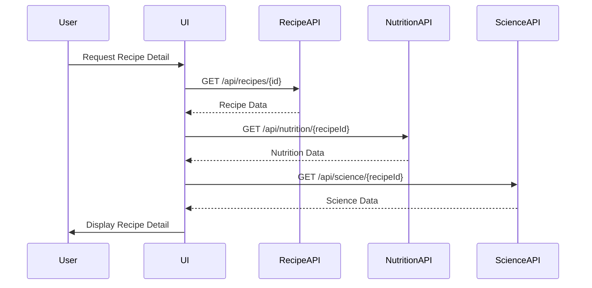

# Recipe Detail System

This document outlines the architecture, implementation, and data flow of the Recipe Detail System within the Recipe Alchemy platform.

## Overview

The Recipe Detail System is responsible for displaying comprehensive information about individual recipes, including ingredients, instructions, nutritional data, scientific explanations, and modification options. It provides a user-friendly interface for viewing and interacting with recipes.

## Architecture

The Recipe Detail System consists of these components:

1. **Recipe Detail Page**: The main React component that renders the recipe details using a tabbed interface.
2. **Data Fetching**: React Query hooks for fetching recipe data, nutritional information, and scientific explanations.
3. **UI Components**: Reusable UI components for displaying recipe information, such as ingredient lists, step-by-step instructions, and nutritional charts.
4. **Modification Interface**: Integration with the Recipe Modification System for adjusting recipes.
5. **Utilities**: Helper functions for printing recipes, converting units, and sharing recipes.

## Data Flow

The data flow for the Recipe Detail System is as follows:



## Implementation Details

### Recipe Detail Page

The main component (`RecipeDetailPage.tsx`) uses a tabbed interface to organize recipe information:

```typescript
// Example RecipeDetailPage.tsx
import React, { useState } from 'react';
import { useRecipe } from '../../hooks/use-recipe';
import { RecipeTab } from './RecipeTab';
import { NutritionTab } from './NutritionTab';
import { ScienceTab } from './ScienceTab';
import { ModifyTab } from './ModifyTab';
import { UtilitiesTab } from './UtilitiesTab';

interface RecipeDetailPageProps {
  recipeId: string;
}

export function RecipeDetailPage({ recipeId }: RecipeDetailPageProps) {
  const [activeTab, setActiveTab] = useState('recipe');
  const { recipe, isLoading, error } = useRecipe(recipeId);

  if (isLoading) {
    return <div>Loading...</div>;
  }

  if (error) {
    return <div>Error: {error.message}</div>;
  }

  return (
    <div>
      <nav>
        <button onClick={() => setActiveTab('recipe')}>Recipe</button>
        <button onClick={() => setActiveTab('nutrition')}>Nutrition</button>
        <button onClick={() => setActiveTab('science')}>Science</button>
        <button onClick={() => setActiveTab('modify')}>Modify</button>
        <button onClick={() => setActiveTab('utilities')}>Utilities</button>
      </nav>

      {activeTab === 'recipe' && <RecipeTab recipe={recipe} />}
      {activeTab === 'nutrition' && <NutritionTab recipe={recipe} />}
      {activeTab === 'science' && <ScienceTab recipe={recipe} />}
      {activeTab === 'modify' && <ModifyTab recipe={recipe} />}
      {activeTab === 'utilities' && <UtilitiesTab recipe={recipe} />}
    </div>
  );
}
```

### Data Fetching

React Query is used to fetch recipe data and related information:

```typescript
// Example useRecipe hook
import { useQuery } from '@tanstack/react-query';
import { fetchRecipe } from '../../api/recipes';

export function useRecipe(recipeId: string) {
  return useQuery({
    queryKey: ['recipe', recipeId],
    queryFn: () => fetchRecipe(recipeId),
  });
}
```

### UI Components

Reusable UI components are used to display recipe information:

- `IngredientList`: Displays a list of ingredients with quantities and units.
- `InstructionList`: Displays step-by-step cooking instructions.
- `NutritionChart`: Visualizes nutritional data using Recharts.
- `ScienceNotes`: Displays scientific explanations of cooking processes.

### Modification Interface

The Recipe Detail System integrates with the Recipe Modification System through a chat interface:

```typescript
// Example ModifyTab.tsx
import React from 'react';
import { Recipe } from '../../types/recipe';
import { RecipeChat } from '../recipe-chat/RecipeChat';

interface ModifyTabProps {
  recipe: Recipe;
}

export function ModifyTab({ recipe }: ModifyTabProps) {
  return (
    <div>
      <h3>Modify Recipe</h3>
      <RecipeChat recipeId={recipe.id} />
    </div>
  );
}
```

### Utilities

Helper functions provide additional functionality:

- `printRecipe`: Generates a printer-friendly version of the recipe.
- `convertUnits`: Converts between metric and imperial units.
- `shareRecipe`: Shares the recipe via social media or email.

## Code Snippets

### Fetching Recipe Data

```typescript
// src/api/recipes.ts
import { supabaseFunctionClient } from './supabaseFunctionClient';
import type { Recipe } from '../types/recipe';

export async function fetchRecipe(recipeId: string): Promise<Recipe> {
  try {
    const { data, error } = await supabaseFunctionClient
      .from('recipes')
      .select('*')
      .eq('id', recipeId)
      .single();

    if (error) {
      throw new Error(error.message);
    }

    return data;
  } catch (error) {
    throw new Error(`Failed to fetch recipe: ${error.message}`);
  }
}
```

### Displaying Ingredients

```typescript
// Example IngredientList.tsx
import React from 'react';
import { Ingredient } from '../../types/recipe';

interface IngredientListProps {
  ingredients: Ingredient[];
}

export function IngredientList({ ingredients }: IngredientListProps) {
  return (
    <ul>
      {ingredients.map((ingredient, index) => (
        <li key={index}>
          {ingredient.quantity} {ingredient.unit} {ingredient.name}
        </li>
      ))}
    </ul>
  );
}
```

## Key Components

### RecipeTab.tsx

```typescript
// RecipeTab.tsx
import React from 'react';
import { Recipe } from '../../types/recipe';
import { IngredientList } from './IngredientList';
import { InstructionList } from './InstructionList';

interface RecipeTabProps {
  recipe: Recipe;
}

export function RecipeTab({ recipe }: RecipeTabProps) {
  return (
    <div>
      <h2>{recipe.title}</h2>
      <h3>Ingredients</h3>
      <IngredientList ingredients={recipe.ingredients} />
      <h3>Instructions</h3>
      <InstructionList instructions={recipe.instructions} />
    </div>
  );
}
```

### NutritionTab.tsx

```typescript
// NutritionTab.tsx
import React from 'react';
import { Recipe } from '../../types/recipe';
import { NutritionChart } from './NutritionChart';

interface NutritionTabProps {
  recipe: Recipe;
}

export function NutritionTab({ recipe }: NutritionTabProps) {
  return (
    <div>
      <h3>Nutrition Information</h3>
      <NutritionChart recipe={recipe} />
    </div>
  );
}
```

### ScienceTab.tsx

```typescript
// ScienceTab.tsx
import React from 'react';
import { Recipe } from '../../types/recipe';
import { ScienceNotes } from './ScienceNotes';

interface ScienceTabProps {
  recipe: Recipe;
}

export function ScienceTab({ recipe }: ScienceTabProps) {
  return (
    <div>
      <h3>Science Notes</h3>
      <ScienceNotes recipe={recipe} />
    </div>
  );
}
```

### UtilitiesTab.tsx

```typescript
// UtilitiesTab.tsx
import React from 'react';
import { Recipe } from '../../types/recipe';

interface UtilitiesTabProps {
  recipe: Recipe;
}

export function UtilitiesTab({ recipe }: UtilitiesTabProps) {
  return (
    <div>
      <h3>Utilities</h3>
      <button onClick={() => printRecipe(recipe)}>Print Recipe</button>
      <button onClick={() => shareRecipe(recipe)}>Share Recipe</button>
    </div>
  );
}
```

## Error Handling

The Recipe Detail System handles errors through:

1. **Error Boundaries**: React error boundaries to catch rendering errors.
2. **API Error Handling**: Centralized error handling in API clients.
3. **User Notifications**: Displaying user-friendly error messages.

## Performance Considerations

The Recipe Detail System is optimized for performance through:

1. **Code Splitting**: Loading only necessary components.
2. **Caching**: Using React Query for data caching.
3. **Image Optimization**: Optimizing recipe images.

## Security Considerations

The Recipe Detail System addresses security through:

1. **Data Validation**: Validating recipe data from the API.
2. **Authentication**: Ensuring only authorized users can access recipes.
3. **Content Security Policy**: Protecting against XSS attacks.

## Related Documentation

- [System Architecture](./system-architecture.md) - Overall system architecture
- [Data Model](./data-model.md) - Database schemas and data structures
- [Recipe Modification Pipeline](../systems/recipe-modification-pipeline.md) - Recipe modification flow
- [Nutrition Analysis System](../systems/nutrition-analysis-system.md) - Nutrition calculation details
- [Science Analysis System](../systems/science-analysis-system.md) - Science content generation
