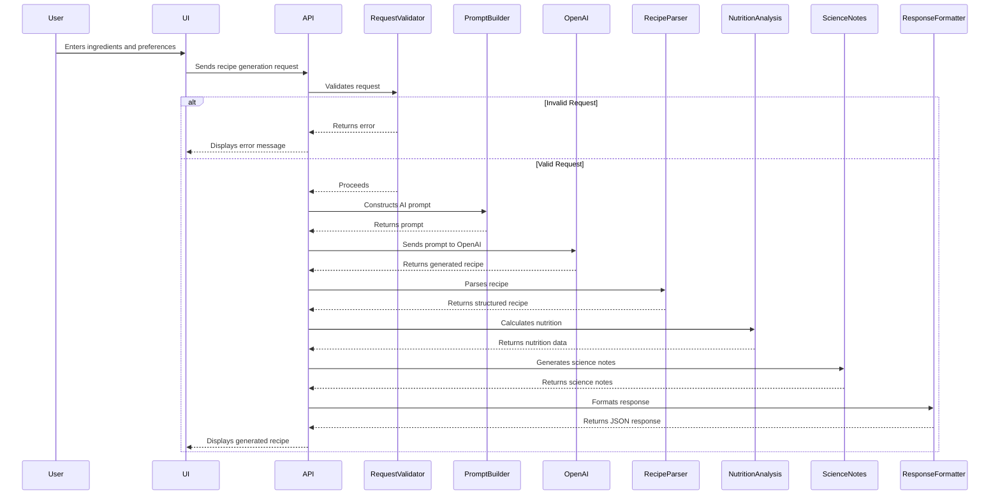

# Recipe Generation Pipeline

This document outlines the architecture, data flow, and implementation details of the recipe generation pipeline in Recipe Alchemy.

## Overview

The recipe generation pipeline is responsible for creating new recipes based on user inputs, leveraging AI models to generate complete recipes with ingredients, instructions, and nutritional information.

## Architecture

The recipe generation pipeline consists of these components:

1. **User Interface**: Provides input fields for ingredients, cuisine preferences, dietary restrictions, and serving size.
2. **API Endpoint**: Receives user inputs and triggers the recipe generation process.
3. **Request Validation**: Validates user inputs to ensure they meet required criteria.
4. **Prompt Builder**: Constructs a prompt for the AI model based on user inputs.
5. **OpenAI Integration**: Sends the prompt to the OpenAI API and receives the generated recipe.
6. **Recipe Parser**: Parses the AI-generated recipe into a structured format.
7. **Nutrition Analysis**: Calculates the nutritional information for the generated recipe.
8. **Science Notes Generation**: Generates scientific explanations for cooking processes and ingredient interactions.
9. **Response Formatting**: Formats the generated recipe and nutritional information into a JSON response.

## Data Flow



## Implementation Details

### User Interface

The user interface provides input fields for:

- Ingredients (free-form text input)
- Cuisine preferences (dropdown selection)
- Dietary restrictions (checkbox selections)
- Serving size (numeric input)

### API Endpoint

The API endpoint is implemented as a Supabase Edge Function:

- **Function Name**: `generate-quick-recipe`
- **Path**: `/api/generate-quick-recipe`
- **Method**: POST
- **Request Body**:
  ```json
  {
    "ingredients": ["chicken", "rice", "vegetables"],
    "cuisine": "Chinese",
    "dietary": ["gluten-free"],
    "servings": 4
  }
  ```
- **Response Body**:
  ```json
  {
    "recipe": {
      "title": "Chicken and Vegetable Stir-Fry",
      "ingredients": [
        {"name": "chicken", "quantity": "1", "unit": "lb"},
        {"name": "rice", "quantity": "2", "unit": "cups"},
        {"name": "vegetables", "quantity": "1", "unit": "lb"}
      ],
      "instructions": [
        {"step": 1, "text": "Stir-fry chicken"},
        {"step": 2, "text": "Add vegetables and rice"},
        {"step": 3, "text": "Cook until done"}
      ]
    },
    "nutrition": {
      "calories": "400",
      "protein": "30g",
      "carbs": "40g",
      "fat": "15g"
    }
  }
  ```

### Request Validation

The request validation component ensures that user inputs meet the required criteria:

- Ingredients: Must be a non-empty array of strings.
- Cuisine: Must be a valid cuisine type.
- Dietary: Must be a valid dietary restriction.
- Servings: Must be a positive integer.

### Prompt Builder

The prompt builder constructs a prompt for the AI model based on user inputs:

- **Base Prompt**:
  ```
  Create a recipe based on the following ingredients: {ingredients}.
  The recipe should be {cuisine} cuisine and should adhere to the following dietary restrictions: {dietary}.
  The recipe should serve {servings} people.
  ```
- **Example Prompt**:
  ```
  Create a recipe based on the following ingredients: chicken, rice, vegetables.
  The recipe should be Chinese cuisine and should adhere to the following dietary restrictions: gluten-free.
  The recipe should serve 4 people.
  ```

### OpenAI Integration

The OpenAI integration component sends the prompt to the OpenAI API and receives the generated recipe:

- **API Endpoint**: `https://api.openai.com/v1/completions`
- **Model**: `text-davinci-003`
- **Prompt**: Constructed by the prompt builder
- **Response**: AI-generated recipe in text format

### Recipe Parser

The recipe parser parses the AI-generated recipe into a structured format:

- **Input**: AI-generated recipe in text format
- **Output**: Structured recipe with ingredients and instructions
- **Parsing Logic**: Regular expressions and string manipulation

### Nutrition Analysis

The nutrition analysis component calculates the nutritional information for the generated recipe:

- **Input**: Structured recipe with ingredients and quantities
- **Output**: Nutritional information (calories, protein, carbs, fat)
- **Calculation Logic**: Mapping ingredients to USDA database and calculating nutritional values

### Science Notes Generation

The science notes generation component generates scientific explanations for cooking processes and ingredient interactions:

- **Input**: Structured recipe with ingredients and instructions
- **Output**: Scientific explanations for cooking processes and ingredient interactions
- **Generation Logic**: Rule-based system and AI model

### Response Formatting

The response formatting component formats the generated recipe and nutritional information into a JSON response:

- **Input**: Structured recipe, nutritional information, and science notes
- **Output**: JSON response with all information

## Code Snippets

### Edge Function Code

```typescript
// supabase/functions/generate-quick-recipe/index.ts
import { serve } from 'https://deno.land/std@0.168.0/http/server.ts';
import { generateRecipe } from './generateRecipe.ts';

serve(async (req) => {
  if (req.method === 'OPTIONS') {
    return new Response('ok', { headers: { 'Access-Control-Allow-Origin': '*' } });
  }

  try {
    const { ingredients, cuisine, dietary, servings } = await req.json();

    if (!ingredients || !Array.isArray(ingredients) || ingredients.length === 0) {
      return new Response(JSON.stringify({ error: 'Ingredients must be a non-empty array' }), {
        status: 400,
        headers: { 'Content-Type': 'application/json' },
      });
    }

    const recipe = await generateRecipe(ingredients, cuisine, dietary, servings);

    return new Response(JSON.stringify({ recipe }), {
      status: 200,
      headers: { 'Content-Type': 'application/json', 'Access-Control-Allow-Origin': '*' },
    });
  } catch (error) {
    console.error('Error generating recipe:', error);
    return new Response(JSON.stringify({ error: 'Failed to generate recipe' }), {
      status: 500,
      headers: { 'Content-Type': 'application/json' },
    });
  }
});
```

### Generate Recipe Function

```typescript
// supabase/functions/generate-quick-recipe/generateRecipe.ts
import { OpenAI } from 'https://deno.land/x/openai@v4.0.0/mod.ts';

const openai = new OpenAI(Deno.env.get('OPENAI_API_KEY'));

async function generateRecipe(ingredients: string[], cuisine: string, dietary: string[], servings: number): Promise<any> {
  const prompt = `Create a recipe based on the following ingredients: ${ingredients.join(', ')}. The recipe should be ${cuisine} cuisine and should adhere to the following dietary restrictions: ${dietary.join(', ')}. The recipe should serve ${servings} people.`;

  const completion = await openai.completions.create({
    model: 'text-davinci-003',
    prompt: prompt,
    max_tokens: 200,
  });

  const recipeText = completion.choices[0].text;
  // Parse the recipeText and return structured data
  return {
    title: "Sample Recipe",
    ingredients: [{name: "Sample Ingredient", quantity: "1", unit: "cup"}],
    instructions: [{step: 1, text: "Do something"}]
  };
}
```

## Error Handling

The recipe generation pipeline implements comprehensive error handling:

- **Input Validation Errors**: Return 400 status code with error message.
- **OpenAI API Errors**: Retry with exponential backoff.
- **Parsing Errors**: Log error and return a default recipe.
- **Nutrition Analysis Errors**: Log error and return recipe without nutrition information.

## Security Considerations

The recipe generation pipeline implements the following security measures:

- **Input Sanitization**: Sanitize user inputs to prevent prompt injection attacks.
- **Rate Limiting**: Limit the number of requests per user to prevent abuse.
- **API Key Protection**: Protect the OpenAI API key by storing it in a secure environment variable.

## Monitoring and Analytics

The recipe generation pipeline is monitored using the following metrics:

- **Request Volume**: Number of recipe generation requests per day.
- **Error Rate**: Percentage of recipe generation requests that result in an error.
- **Response Time**: Average time to generate a recipe.
- **Token Usage**: Number of tokens used per recipe generation request.

## Related Documentation

- [AI Prompts Overview](../ai-prompts/overview.md) - AI prompt engineering
- [Nutrition Analysis System](./nutrition-analysis-system.md) - Nutritional data processing
- [Science Analysis System](./science-analysis-system.md) - Scientific content generation
- [API Reference](../developer-guide/code-structure.md) - API endpoint details
