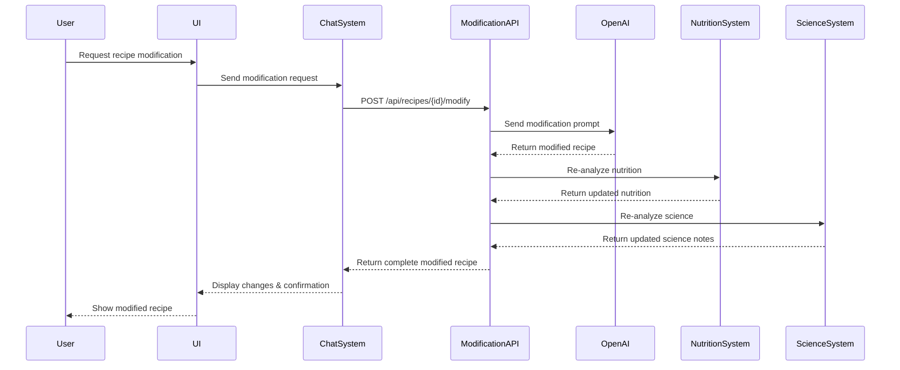

# Recipe Modification Pipeline

This document outlines the architecture and implementation of the recipe modification pipeline in Recipe Alchemy. This system allows users to modify existing recipes through a conversational AI interface, adapting them to specific dietary needs, ingredient availability, or flavor preferences.

## System Overview

The recipe modification pipeline consists of the following components:

1. **User Interface**: A chat-based interface for users to request modifications.
2. **Chat System**: Processes user input and generates modification suggestions.
3. **Modification API**: Applies the suggested modifications to the recipe.
4. **AI Model**: Uses OpenAI's GPT models to understand and implement the modifications.
5. **Nutrition Analysis System**: Recalculates nutritional information after modifications.
6. **Science Analysis System**: Updates scientific explanations to reflect the changes.

## Architecture Diagram



## Data Flow

1. **User Request**: The user enters a modification request in the chat interface.
2. **Chat System Processing**: The chat system parses the request and sends it to the Modification API.
3. **AI Processing**: The Modification API uses OpenAI to generate a modified recipe based on the request.
4. **Nutrition Analysis**: The Nutrition Analysis System recalculates the nutritional information for the modified recipe.
5. **Science Analysis**: The Science Analysis System updates the scientific explanations to reflect the changes.
6. **Response**: The modified recipe, along with updated nutritional and scientific information, is returned to the user.

## Components

### 1. User Interface

- **Technology**: React
- **Description**: A chat-based interface that allows users to enter modification requests.
- **Responsibilities**:
  - Capturing user input.
  - Displaying modification suggestions.
  - Allowing users to accept or reject changes.

### 2. Chat System

- **Technology**: Supabase Edge Function
- **Description**: Processes user input and generates modification suggestions.
- **Responsibilities**:
  - Parsing user input.
  - Communicating with the Modification API.
  - Displaying the modified recipe to the user.

### 3. Modification API

- **Technology**: Supabase Edge Function
- **Description**: Applies the suggested modifications to the recipe.
- **Responsibilities**:
  - Receiving modification requests from the Chat System.
  - Calling the OpenAI API to generate a modified recipe.
  - Coordinating with the Nutrition Analysis and Science Analysis Systems.
  - Returning the modified recipe to the Chat System.

### 4. AI Model

- **Technology**: OpenAI GPT-4
- **Description**: Understands and implements the modifications.
- **Responsibilities**:
  - Generating a modified recipe based on the user's request.
  - Maintaining the culinary integrity of the recipe.

### 5. Nutrition Analysis System

- **Technology**: Supabase Edge Function
- **Description**: Recalculates nutritional information after modifications.
- **Responsibilities**:
  - Receiving the modified recipe from the Modification API.
  - Calculating the updated nutritional information.
  - Returning the updated information to the Modification API.

### 6. Science Analysis System

- **Technology**: Supabase Edge Function
- **Description**: Updates scientific explanations to reflect the changes.
- **Responsibilities**:
  - Receiving the modified recipe from the Modification API.
  - Updating the scientific explanations.
  - Returning the updated explanations to the Modification API.

## Implementation Details

### Modification API Endpoint

- **Endpoint**: `/api/recipes/{id}/modify`
- **Method**: POST
- **Request Body**:
  ```json
  {
    "modificationRequest": "Make it vegetarian",
    "recipe": {
      "id": "recipe123",
      "title": "Original Recipe",
      "ingredients": [
        {"name": "Chicken", "quantity": "1", "unit": "lb"},
        {"name": "Vegetables", "quantity": "2", "unit": "cup"}
      ],
      "steps": ["Cook chicken", "Add vegetables"]
    }
  }
  ```
- **Response Body**:
  ```json
  {
    "modifiedRecipe": {
      "id": "recipe123-modified",
      "title": "Vegetarian Recipe",
      "ingredients": [
        {"name": "Tofu", "quantity": "1", "unit": "lb"},
        {"name": "Vegetables", "quantity": "2", "unit": "cup"}
      ],
      "steps": ["Cook tofu", "Add vegetables"]
    },
    "nutrition": {
      "calories": "300",
      "protein": "20g",
      "fat": "10g",
      "carbs": "30g"
    },
    "scienceNotes": [
      "Tofu is a great source of protein for vegetarians."
    ]
  }
  ```

### OpenAI Prompt Engineering

- **Prompt Structure**:
  ```
  You are a recipe modification expert. Given the following recipe and modification request, generate a modified recipe that satisfies the request while maintaining the culinary integrity of the recipe.

  Recipe:
  {recipe}

  Modification Request:
  {modificationRequest}

  Modified Recipe:
  ```
- **Example Prompt**:
  ```
  You are a recipe modification expert. Given the following recipe and modification request, generate a modified recipe that satisfies the request while maintaining the culinary integrity of the recipe.

  Recipe:
  {
    "id": "recipe123",
    "title": "Original Recipe",
    "ingredients": [
      {"name": "Chicken", "quantity": "1", "unit": "lb"},
      {"name": "Vegetables", "quantity": "2", "unit": "cup"}
    ],
    "steps": ["Cook chicken", "Add vegetables"]
  }

  Modification Request:
  Make it vegetarian

  Modified Recipe:
  ```

### Code Example

```typescript
// Supabase Edge Function: modify-quick-recipe/index.ts
import { serve } from 'https://deno.land/std@0.168.0/http/server.ts';
import { corsHeaders } from '../_shared/cors.ts';
import { supabaseFunctionClient } from '../_shared/supabaseClient.ts';

const OpenAIKey = Deno.env.get('OPENAI_API_KEY');

serve(async (req) => {
  // Handle CORS preflight requests
  if (req.method === 'OPTIONS') {
    return new Response(null, { headers: corsHeaders });
  }

  try {
    const { recipe, modificationRequest } = await req.json();

    // Validate input
    if (!recipe || !modificationRequest) {
      throw new Error('Recipe and modification request are required.');
    }

    // Construct the prompt
    const prompt = `You are a recipe modification expert. Given the following recipe and modification request, generate a modified recipe that satisfies the request while maintaining the culinary integrity of the recipe.

    Recipe:
    ${JSON.stringify(recipe)}

    Modification Request:
    ${modificationRequest}

    Modified Recipe:`;

    // Call OpenAI API
    const response = await fetch('https://api.openai.com/v1/completions', {
      method: 'POST',
      headers: {
        'Content-Type': 'application/json',
        'Authorization': `Bearer ${OpenAIKey}`,
      },
      body: JSON.stringify({
        model: 'gpt-4',
        prompt: prompt,
        max_tokens: 500,
        temperature: 0.7,
      }),
    });

    const data = await response.json();

    if (!response.ok) {
      console.error('OpenAI API error:', data);
      throw new Error(`OpenAI API error: ${data.error?.message || 'Unknown error'}`);
    }

    const modifiedRecipe = data.choices[0].text.trim();

    // Call Nutrition Analysis System (Placeholder)
    const nutritionAnalysis = {
      calories: '300',
      protein: '20g',
      fat: '10g',
      carbs: '30g'
    };

    // Call Science Analysis System (Placeholder)
    const scienceNotes = [
      "This is a placeholder for science notes."
    ];

    // Return the modified recipe, nutrition analysis, and science notes
    return new Response(
      JSON.stringify({
        modifiedRecipe: modifiedRecipe,
        nutrition: nutritionAnalysis,
        scienceNotes: scienceNotes
      }),
      { headers: { ...corsHeaders, 'Content-Type': 'application/json' }, status: 200 }
    );
  } catch (error) {
    console.error('Function error:', error);
    return new Response(
      JSON.stringify({ error: error.message }),
      { headers: { ...corsHeaders, 'Content-Type': 'application/json' }, status: 500 }
    );
  }
});
</script>
```

## Error Handling

The recipe modification pipeline handles errors as follows:

- **Input Validation Errors**: The API validates the input and returns an error message if the input is invalid.
- **OpenAI API Errors**: The API handles errors from the OpenAI API and returns an error message to the user.
- **Nutrition Analysis Errors**: If the Nutrition Analysis System fails, the API returns an error message to the user.
- **Science Analysis Errors**: If the Science Analysis System fails, the API returns an error message to the user.

## Security Considerations

The recipe modification pipeline has the following security considerations:

- **Input Sanitization**: The API sanitizes user input to prevent prompt injection attacks.
- **Rate Limiting**: The API rate limits requests to prevent abuse.
- **Authentication**: The API requires authentication to prevent unauthorized access.

## Related Documentation

- [System Architecture](../architecture/system-architecture.md) - Overall system architecture
- [Recipe Chat System](./recipe-chat-system.md) - Conversational AI system
- [Nutrition Analysis System](./nutrition-analysis-system.md) - Nutritional calculation system
- [Science Analysis System](./science-analysis-system.md) - Scientific content generation
- [AI Prompts Overview](../ai-prompts/overview.md) - AI prompt engineering
