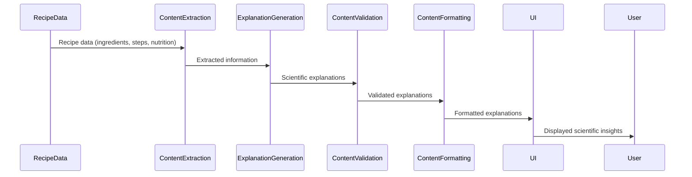

# Science Analysis System

This document outlines the architecture, implementation, and data flow of the Science Analysis System within the Recipe Alchemy platform.

## Overview

The Science Analysis System is responsible for generating scientific explanations of cooking processes, ingredient interactions, and nutritional concepts. It provides users with insights into the science behind cooking, enhancing their understanding and appreciation of culinary techniques.

## System Architecture

The Science Analysis System consists of these components:

1. **Content Extraction**: Extracts relevant information from recipe steps, ingredients, and nutritional data.
2. **Scientific Explanation Generation**: Uses AI models to generate scientific explanations based on extracted information.
3. **Content Validation**: Validates the accuracy and clarity of generated explanations.
4. **Content Formatting**: Formats the explanations for display in the user interface.

## Data Flow

The data flow through the Science Analysis System is as follows:



## Content Extraction

The Content Extraction component identifies key elements within the recipe data:

- **Ingredients**: Extracts ingredient names, quantities, and preparations.
- **Cooking Steps**: Identifies cooking methods, temperatures, and timings.
- **Nutritional Data**: Retrieves macronutrient and micronutrient information.

## Scientific Explanation Generation

The Explanation Generation component uses AI models to generate scientific explanations:

- **Prompt Engineering**: Constructs prompts that guide the AI model to generate accurate and relevant explanations.
- **AI Model Invocation**: Calls the AI model with the generated prompts.
- **Response Parsing**: Parses the AI model's response to extract the scientific explanation.

## Content Validation

The Content Validation component ensures the accuracy and clarity of the generated explanations:

- **Fact Checking**: Verifies the scientific accuracy of the explanations against established scientific literature.
- **Clarity Assessment**: Evaluates the readability and understandability of the explanations.
- **Style Consistency**: Ensures that the explanations adhere to the Recipe Alchemy's scientific styling guide.

## Content Formatting

The Content Formatting component formats the explanations for display in the user interface:

- **Text Formatting**: Applies appropriate formatting to the text, including headings, lists, and emphasis.
- **Media Integration**: Integrates relevant images, diagrams, and videos to enhance the explanations.
- **Responsive Design**: Ensures that the explanations are displayed correctly on different devices.

## Implementation Details

### Technologies Used

- **TypeScript**: Programming language
- **OpenAI API**: AI model for explanation generation
- **React**: User interface framework
- **Markdown**: Content formatting

### Code Structure

The Science Analysis System is implemented in the following files:

```
src/
├── ai-nutrition/                   # Nutrition processing utilities
├── utils/
│   ├── recipe-normalization.ts    # Recipe data normalization
│   └── slug-utils.ts             # URL slug utilities
├── api/
│   ├── fetch-quick-recipe.ts      # Recipe generation API
│   ├── generate-quick-recipe.ts   # Recipe creation API
│   └── supabaseFunctionClient.ts  # Supabase client
├── components/
│   ├── recipe-detail/             # Recipe detail components
│   │   ├── RecipeDetail.tsx       # Recipe detail component
│   │   └── ScienceTab.tsx         # Science tab component
├── hooks/
│   └── use-recipe-detail.ts      # Recipe detail hook
└── types/
    └── recipe.ts                  # Recipe data model
```

### Key Functions

- `generateScientificExplanations(recipe: RecipeData)`: Generates scientific explanations for a given recipe.
- `validateScientificExplanation(explanation: string)`: Validates the accuracy and clarity of a scientific explanation.
- `formatScientificExplanation(explanation: string)`: Formats a scientific explanation for display in the user interface.

## Integration with Other Systems

The Science Analysis System integrates with other systems in the Recipe Alchemy platform:

- **Recipe Generation System**: Receives recipe data from the Recipe Generation System.
- **Recipe Detail System**: Displays scientific explanations in the Recipe Detail System.
- **Recipe Modification System**: Updates scientific explanations when a recipe is modified.

## Future Enhancements

- **Personalized Explanations**: Tailor scientific explanations to the user's knowledge level and interests.
- **Interactive Explanations**: Allow users to explore scientific concepts in more detail through interactive diagrams and simulations.
- **Multilingual Support**: Provide scientific explanations in multiple languages.

## Related Documentation

- [System Architecture](./system-architecture.md) - Overall system architecture
- [Recipe Generation Pipeline](./recipe-generation-pipeline.md) - Recipe creation flow
- [Recipe Detail System](./recipe-detail-system.md) - Recipe viewing system
- [AI Prompts Overview](../ai-prompts/overview.md) - AI prompt systems
