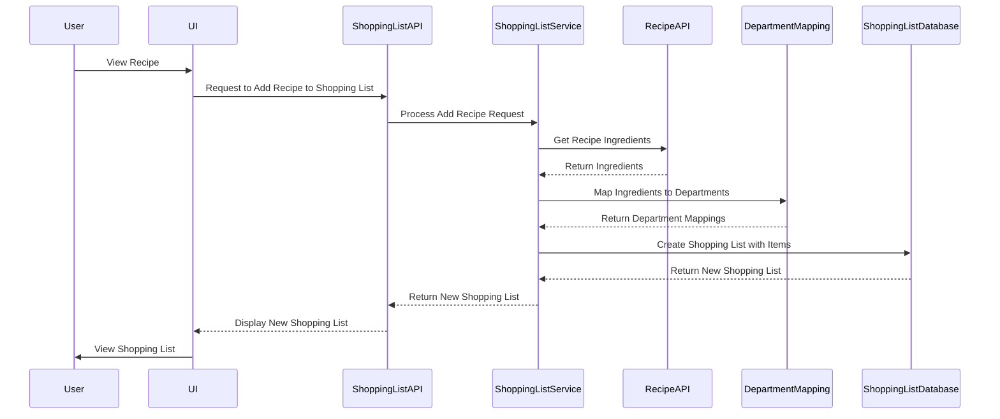

# Shopping List System

This document outlines the architecture, implementation, and data flow of the shopping list system in Recipe Alchemy.

## Overview

The shopping list system allows users to create and manage grocery lists based on recipe ingredients. It provides features for:

- Creating new lists
- Adding items from recipes
- Organizing items by department
- Tracking progress
- Sharing lists

## Architecture

The shopping list system consists of these components:

1. **Shopping List API**: Provides endpoints for creating, reading, updating, and deleting shopping lists.
2. **Shopping List Service**: Implements the business logic for managing shopping lists, including adding items, organizing by department, and tracking progress.
3. **Shopping List Database**: Stores shopping list data, including list metadata, items, and user associations.
4. **Recipe Integration**: Integrates with the recipe system to automatically add ingredients to shopping lists.
5. **Department Mapping**: Maps ingredients to grocery store departments for organization.

## Data Model

The shopping list system uses these data models:

```typescript
interface ShoppingList {
  id: string;
  userId: string;
  name: string;
  createdAt: Date;
  updatedAt: Date;
  items: ShoppingListItem[];
}

interface ShoppingListItem {
  id: string;
  shoppingListId: string;
  name: string;
  quantity: number;
  unit: string;
  department: string;
  checked: boolean;
}
```

## API Endpoints

The Shopping List API provides these endpoints:

| Method | Endpoint | Description |
|---|---|---|
| GET | /api/shopping-lists | Get all shopping lists for the current user |
| GET | /api/shopping-lists/:id | Get a specific shopping list |
| POST | /api/shopping-lists | Create a new shopping list |
| PUT | /api/shopping-lists/:id | Update a shopping list |
| DELETE | /api/shopping-lists/:id | Delete a shopping list |
| POST | /api/shopping-lists/:id/items | Add an item to a shopping list |
| PUT | /api/shopping-lists/:id/items/:itemId | Update an item in a shopping list |
| DELETE | /api/shopping-lists/:id/items/:itemId | Delete an item from a shopping list |

## Data Flow

The data flow for creating a shopping list from a recipe is as follows:



## Implementation Details

### Department Mapping

The department mapping component uses a combination of:

- **Static Mapping**: A predefined mapping of common ingredients to departments.
- **AI-Powered Mapping**: An AI model that can map less common ingredients to departments based on their description.

### Progress Tracking

The progress tracking component calculates the completion percentage of a shopping list based on the number of checked items.

## Error Handling

The shopping list system handles errors as follows:

- **API Errors**: API endpoints return standard HTTP error codes with JSON error messages.
- **Service Errors**: The shopping list service throws exceptions for invalid operations, such as adding an item to a non-existent list.
- **Database Errors**: Database errors are caught and logged, and a generic error message is returned to the user.

## Security

The shopping list system enforces these security measures:

- **Authentication**: All API endpoints require authentication.
- **Authorization**: Users can only access their own shopping lists.
- **Data Validation**: All input data is validated to prevent injection attacks.

## Related Documentation

- [Data Model](../architecture/data-model.md) - Data structures and schemas
- [System Architecture](../architecture/system-architecture.md) - Overall system architecture
- [Integration Patterns](../architecture/integration-patterns.md) - How systems interact
